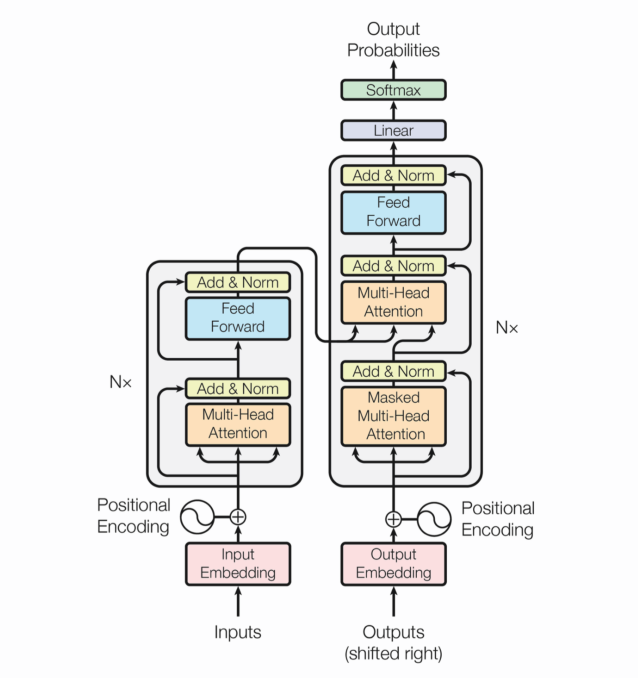

## 时间线
- NNLM(2003)
    - 语言模型: 计算一个句子的概率的模型
        - 评价指标
            - 困惑度
        - 基于统计的N-Gram语言模型: 平滑方法
            - 缺点
                - N不能太大, 无法考虑长距离依赖
                - 基于词的共现, 泛化能力差
        - 神经网络:  得到副产品词向量, 训练速度慢
            - 特征映射: 嵌入矩阵
            - 条件概率分布: 神经网络
- Word Embeddings(2013)
    - 词的表示方式: 词映射到语义空间中的一个点(词向量)
        - one-hot向量
          - 优点: 简单
          - 缺点
              - 相同的词距离为0, 不同的距离为1
              - 高维的稀疏向量
        - Distributional表示: 两个词的上下文相似, 那么这两个词的语义就相似
            - Word2Vec: 一个词的语义可以由它的上下文确定 
                - Continuous Bag-of-Word: 用一个词的上下文来预测这个词
                - Skip-Gram: 一个词来预测它的上下文
                - 加速方法
                    - Hierarchical Softmax: Huffman树
                    - Negative Sampling: 采样一部分计算
            - GloVe
            - FastText
        - [Chinese-Word-Vectors](https://github.com/Embedding/Chinese-Word-Vectors)
- Seq2Seq(2014)
    - RNN: 记忆能力, 顺序依赖,无法并行
        - 隐状态
        - 参数共享
        - 每一时刻都有输出
    - LSTM/GRU: 解决长距离依赖问题
        - 门机制
    - Seq2Seq: 定长的context向量
        - Encoder
        - Decoder
- Attention(2015)
    - 资源分配方案
- Memory-based networks(2015)
    - 外部记忆
- Transformer(2017)
    - 问题
        - RNN不能考虑整句
        - Attention需要外部驱动
    - Transformer : 并行性好
        - Postion encoding : 三角函数能够表达相对位置(加法公式)
        - Multi-Heads: 平均分配特征维长度
            - Self-Attention: 查询Q 键值对(K, V)
            - Mask: 乘一个足够大的负数后再softmax结果足够小
                - Padding Mask: 忽略填充
                - Sequence Mask: 隐藏t时刻后信息
            - Add & LayerNorm
- BERT(2018)
- XLNET(2019)
- ALBERT(2020) ?

## 预训练语言模型
- 趋势
    - 引入知识和常识
    - 预训练语言模型
        - Contextual Word Embedding
            - 无监督
            - 考虑上下文的Embedding
        - 统一编码和解码
    - 低资源NLP任务
    - 模型可解释性
    - 更多任务&数据集
- 预训练语言模型
    - 特征抽取
        - 长距离依赖建模
            - Transformer-XL > Transformer > RNNs > CNNs
        - 前馈/循环 or 串行/并行
            - MLP/CNNs/Transformer: 前馈/并行
            - RNNs/Transformer-XL: 循环/串行
        - 计算复杂度: 序列长度n, 嵌入层大小d, 滤波器大小k
            - CNNs: O(knd^2)
            - RNNs: O(nd^2)
            - Self Attention: O(n^2d)
        - 例子
            - ELMO: 多层双向LSTM
            - OpenAI GPT: Transformer
                - 单向
                - Pretrainng和Fine-Tuning不匹配
            - BERT: Transformer
                - Masked LM : 随机Mask掉15%的词
                - Multi-Task Learning: 预测下一个句子任务 
                - Fine-Tuning
            - XLNET: Transformer-XL
                - 语言模型 vs Bert
                    - 独立假设
                    - 输入噪声
                    - 双向上下文
                - 排列语言模型
                    - Two-Stream
                - Transformer-XL: Segment基本的状态重用, 不需要定长
    - 语言目标
        - 自回归: 单向模型和XLNET
            - 传统语言模型, 天然适合NLG/排列语言模型
            - 顺序拆解, 无法通过上下问进行双向特征表示
        - 自编码: BERT系列
            - MLM
            - 独立性假设
    - 特征表示
        - 单向特征: 标签泄露
        - 双向特征
    - BERT:
        - 特点
            - MLM: 能够获取上下文相关的双向特征表示
            - NSP: 擅长处理句子或段落的匹配任务
            - Transformer: 强大的特征抽取机制
            - 数据: 大规模, 高质量文本数据
        - 缺点
            - 生成任务表现不佳：预训练过程和生成过程的不一致，导致在生成任务上效果不佳
            - 采取独立性假设：没有考虑预测[MASK]之间的相关性，是对语言模型联合概率的有偏估计
            - 输入噪声[MASK]，造成预训练-精调两阶段之间的差异
            - 无法文档级别的NLP任务，只适合于句子和段落级别的任务
    - BERT的改进
        - 引入知识根据文件所在目录的inode信息，找到目录文件对应数据块
            - ERNIE1.0: 3种[MASK]策略
            - ERNIE(THU): 知识图谱嵌入
        - 引入多任务学习
            - MTDNN: 下游任务引入多任务机制
            - ERNIE2.0: 预训练引入多任务学习, 增量学习
        - 生成任务
            - MASS: Seq2Seq框架
            - UNILM
        - [MASK]策略
            - BERT WWM: whole word mask
            - ERNIE
            - SpanBERT: 随机
        - 精细调参
            - RoBERTa
                - 丢弃NSP
                - 动态改变MASK策略
                - 对学习率的峰值和warm-up更新步数作出调整
                - 在更长的序列上训练： 不对序列进行截短，使用全长度序列
        - XLNET: AR + AE
            - 排列语言模型
            - Two-Stream Self-Attention
                - Query
                - Content
            - Transformer-XL
                - Recurrence mechanism
                - 相对位置编码
        - ALBERT
            - 嵌入参数化的因式分解
                - 词嵌入学习上下文无关的表示
                - 隐藏层嵌入学习上下文相关的表示
            - 跨层参数共享: 神经网络参数的鲁棒性
            - 句间连贯性损失
- BERT的应用
    - 擅长
        - NLP任务偏向在语言本身中就包含答案，而不特别依赖文本外的其它特征
        - 特别适合解决句子或者段落的匹配类任务
            - 加入其他任务
            - 单句重构
        - 深层语义特征的需求程度有关
        - 解决输入长度不太长的NLP任务
    - QA与阅读理解: 语义相似性
        - 检索: BM25+RM3
        - QA问答判断
    - 搜索与信息检索
        - 特点
            - 相关性
            - 长文本
                - 文档分割成句子
            - 其他因素(推荐)
    - 对话系统/聊天机器人
        - 面向任务
            - 意图分类
            - 槽位填充
        - 多轮对话
    - 文本摘要
        - 生成式
        - 抽取式: 输入端需要输入整个文章内容，而分类的判断对象仅仅是当前要做判断的某个句子
            - 输入端明确加入一些标记符号，用来区分不同的句子
    - 数据增强: 输入句子的对应类标号
    - 文本分类
    - In Domain vs Out Domain
        - Stage-wise

- 推荐系统
    - 组成部分
        - 物料质量评估
        - 用户兴趣建模
        - 物品内容理解: 多模态融合
        - 召回/粗排: FM
        - 精排: DeepFM
        - 离线及在线的大规模机器学习模型训练及服务
    - 趋势: 深度 数据
        - 模型: Transformer
        - 多模态融合/多目标
        - 多任务/迁移学习
        - AutoML
- 信息检索
    - ad hoc: 数据库相对不变
        - 查询的扩展
        - 匹配
    - filtering: 用户兴趣topic相对不变
        - routing
        - adaptive filtering
        - batch filtering
    - 方法
        - 向量空间
        - 概率模型