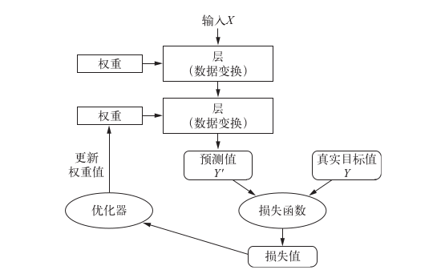
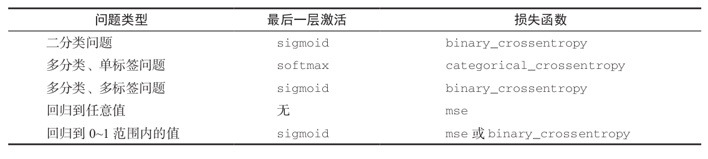

## Hello TensorFlow
- 初学
```python
import tensorflow as tf

# Load and prepare the MNIST dataset
mnist = tf.keras.datasets.mnist

(x_train, y_train), (x_test, y_test) = mnist.load_data()
x_train, x_test = x_train / 255.0, x_test / 255.0

# Build model
model = tf.keras.models.Sequential([
  tf.keras.layers.Flatten(input_shape=(28, 28)),
  tf.keras.layers.Dense(128, activation='relu'),
  tf.keras.layers.Dropout(0.2),
  tf.keras.layers.Dense(10, activation='softmax')
])

model.compile(optimizer='adam',
              loss='sparse_categorical_crossentropy',
              metrics=['accuracy'])

# Train and evaluate the model
model.fit(x_train, y_train, epochs=5)

model.evaluate(x_test, y_test)
```
- 专家
```python
import tensorflow as tf

from tensorflow.keras.layers import Dense, Flatten, Conv2D
from tensorflow.keras import Model

# Load and prepare the MNIST dataset
mnist = tf.keras.datasets.mnist

(x_train, y_train), (x_test, y_test) = mnist.load_data()
x_train, x_test = x_train / 255.0, x_test / 255.0

# Add a channels dimension
x_train = x_train[..., tf.newaxis]
x_test = x_test[..., tf.newaxis]

# Use tf.data to batch and shuffle the dataset
train_ds = tf.data.Dataset.from_tensor_slices(
    (x_train, y_train)).shuffle(10000).batch(32)
test_ds = tf.data.Dataset.from_tensor_slices((x_test, y_test)).batch(32)

#Build model using the Keras model subclassing API
class MyModel(Model):
  def __init__(self):
    super(MyModel, self).__init__()
    self.conv1 = Conv2D(32, 3, activation='relu')
    self.flatten = Flatten()
    self.d1 = Dense(128, activation='relu')
    self.d2 = Dense(10, activation='softmax')

  def call(self, x):
    x = self.conv1(x)
    x = self.flatten(x)
    x = self.d1(x)
    return self.d2(x)

model = MyModel()

# Choose an optimizer, loss function and metrics
loss_object = tf.keras.losses.SparseCategoricalCrossentropy()

optimizer = tf.keras.optimizers.Adam()

train_loss = tf.keras.metrics.Mean(name='train_loss')
train_accuracy = tf.keras.metrics.SparseCategoricalAccuracy(name='train_accuracy')

test_loss = tf.keras.metrics.Mean(name='test_loss')
test_accuracy = tf.keras.metrics.SparseCategoricalAccuracy(name='test_accuracy')

# Train the model
@tf.function
def train_step(images, labels):
  with tf.GradientTape() as tape:
    predictions = model(images)
    loss = loss_object(labels, predictions)
  gradients = tape.gradient(loss, model.trainable_variables)
  optimizer.apply_gradients(zip(gradients, model.trainable_variables))

  train_loss(loss)
  train_accuracy(labels, predictions)

# Test the model
@tf.function
def test_step(images, labels):
  predictions = model(images)
  t_loss = loss_object(labels, predictions)

  test_loss(t_loss)
  test_accuracy(labels, predictions)

EPOCHS = 5

for epoch in range(EPOCHS):
  for images, labels in train_ds:
    train_step(images, labels)

  for test_images, test_labels in test_ds:
    test_step(test_images, test_labels)

  template = 'Epoch {}, Loss: {}, Accuracy: {}, Test Loss: {}, Test Accuracy: {}'
  print (template.format(epoch+1,
                         train_loss.result(),
                         train_accuracy.result()*100,
                         test_loss.result(),
                         test_accuracy.result()*100))
```
## 数据表示与运算
- 数据表示:`Numpy`张量
    - 轴的个数:`ndim`
        - 向量数据:`(samples, features)`
        - (时间)序列数据:`(samples, timesteps, features)`
        - 图像:`(samples, height, width, channels)`
        - 视频:`(samples, frames, height, width, channels)`
    - 形状:`shape`
    - 数据类型:`dtype`
- 张量运算
    - 逐元素运算:`+`
    - 广播:`(a, b, ..., n, n+1, ..., m) + (n, n+1, ..., m)`
    - 张量点积:`dot`
    - 张量变形:`reshape`
- 自动微分:`tf.GradientTape`记录操作
    ```python
    import tensorflow as tf

    x = tf.ones((2, 2))

    with tf.GradientTape() as t:
        t.watch(x)
        y = tf.reduce_sum(x)
        z = tf.multiply(y, y)

    # Derivative of z with respect to the original input tensor x
    dz_dx = t.gradient(z, x)

    ```  
    - 保留资源和删除:`GrandientTape(persistent=True)` `del t`
    - 高阶导数:嵌套`GradientTape`

## Tensorfow 2.0
- 运行1.X代码: `tf.disable_v2_behavior()`
- Eager excution vs Graph: imperative interface vs deploy model
- Ragged tensors : nested variable-length lists
- 深度学习流程 
- 获得数据
    - 已有数据
        - `tf.keras.datasets.mnist.load_data()`
        - Tensorflow datasets : `tfds.load()`
    - 下载数据
        - `tf.keras.utils.get_file()`
- 数据预处理
    - `tf.keras.preprocessing`
        - image: `image.ImageDataGenerator`
        - text: `text.Tokenizer()`
        - sequence: `sequence.pad_sequences()`
    - `tf.data`
        - image: `tf.image`
        - text: `tfds.features.text.SubwordEncoder.bulid_from_corpus()`
        - 结构性数据: 
            - CSV: `tf.data.experimental.make_csv_dataset()`
                - `tf.feature_column`
            - Numpy
        - TFRecords
        - `tf.data.Dataset.from_tensor_slices()`
        - Embedding Projector `vecs.tsv`
- 构建模型: `model = tf.keras.Sequential()`
    - 定义层: `tf.keras.layers`
        - `layers.Embedding(mask_zero=True)`
        - 冻结参数: `layer.trainable = False`
        - 预训练模型
            - TensorFlow Hub: `hub.kerasLayer(url)`
            - `tf.keras.applications`
    - 编译模型: `model.compile()`
        - 优化器: `optimizer = 'adam'`
        - 损失函数: `loss = 'sparse_categorical_crossentropy'`
        - 指标: `metrics = ['accuracy']`
    - 自定义
        - 层: 继承`tf.keras.layers.Layer`
        - 模型: 继承`tf.keras.Model`
- 训练模型: `history = model.fit()`
    - 回调函数:`tf.keras.callbacks.EarlyStoping()`
        - 保存模型
            - 只保留权重:`tf.keras.callbacks.ModelCheckpoint()`
            - 整个模型(不能保存TensorFlow优化器): `model.save('filename.h5')`
                - 实验性(未来可能变化): `tf.keras.experimental.export_saved_model()`
        - 读取模型: TFLite TFjs
            - 读取权重: `model.load_weights()`
            - 读取模型: `tf.keras.models.load_model('filename.h5')`
    - 自定义训练: AutoGraph `@tf.function`
        - 定义损失:`tf.keras.losses.SparseCategoricalCrossentropy()`
        - 计算梯度: `t.gradient(loss, model.trainable_variables)`
            - 自动微分: `with tf.GradientTape() as t`
        - 定义优化器: `tf.keras.optimizers.Adam()`
            - `optimizer.apply_gradients(zip(grads, model.trainable_variables))`
        - 记录指标: `tf.keras.metrics.SparseCategoricalAccuracy()`
    - 分布式训练: `tf.distribute.MirroredStrategy`
    - 利用GPU:`tf.test.is_gpu_available()`
    - 学习曲线: `history.history`
- 评估模型: `model.evaluate()`
- 预测: `model.predict(test_data)`
-------
## 待整理
- 加载数据集:`keras.datasets`
    - 数据代表性:浮点数张量
    - 时间箭头
    - 非平稳问题:在平稳的时间尺度上收集问题
    - 数据冗余
- 数据预处理
    - 数据向量化
        - 编码标签(多分类)
            - One-hot:`keras.utils.to_categorical(train_labels)`
            - 整数张量:`loss='sparse_categorical_crossentropy'`
    - 值标准化
    - 处理缺失值
    - 特征工程:大部分的特征工程现代深度学习都是不需要的
- 网络架构:`model.summary()`
    - 定义模型
        - Sequential类: `model = keras.models.Sequential()`
        - 函数式API:多输入 多输出 类图
        ```python
        Model = tf.keras.models.Model
        layers = tf.keras.layers
        Input = tf.keras.Input

        input_tensor = Input(shape=(64,))
        x = layers.Dense(32, activation='relu')(input_tensor)
        x = layers.Dense(32, activation='relu')(x)
        output_tensor = layers.Dense(10, activation='softmax')(x)

        model = Model(input_tensor, output_tensor)
        ``` 
    - 全连接层:`keras.layers.Dense(units, **kwargs)`
        - 激活函数:`activation='relu'`
        - 正则化
            - L1或L2: `kernel_regularizer=keras.regularizers.l1_l2(0.001)`
            - Dropout层(在层的输出值中引入噪声,破坏不显著的偶然模式): `keras.layers.Dropout(0.5)`
- 编译步骤: `model.compile(**kwargs)`
    - 损失函数(`keras.losses`):`loss='categorical_crossentropy'` 
        - 序列学习 -> 联结主义时序分类(CTC)
    - 优化器(`keras.optimizers`): `optimizer='rmsprop'`
    - 训练和测试过程中需要的监控的指标(`keras.metrics`):`metric=['accuracy']`
        - 平衡分类:精度和ROC AUC 
        - 不平衡分类: Precise Recall
- 训练:`history = model.fit(x_train, y_train, batch_size=128, epochs=10, **kwargs)`
    - 验证集:`validation_data=(x_val, y_val)`
        - K折交叉验证
        - 带有打乱数据的重复K折验证:多次K折验证
    - 正则化
        - L1或L2: `kernel_regularizer=keras.regularizers.l1_l2(0.001)`
        - Dropout(在层的输出值中引入噪声,破坏不显著的偶然模式): `keras.layers.Dropout(0.5)`
    - 训练过程中的所有数据:`history_dict = history.history`
    - 保存模型:`model.save('filename.h5')`
        - 加载保存的模型:`keras.models.load_model('filname.h5')`
- 分析结果
    - 过拟合
    - 平滑曲线:数据点替换为前面数据点的指数移动平均值
- 评估在测试集上的性能: `test_loss, test_acc = model.evaluate(x_test, y_test)`
    - 预测:`model.predict(x_test)`
- 回调函数: `keras.callbacks`
    - Model checkpointing
    - early stopping
    - 动态调节某些参数
    - 记录训练指标, 可视化
- 批标准化:`BatchNormalization()`
## 神经网络实践
- 卷积(Concolution)神经网络:输入/输出形状`(image_height, image_width, image_depth)`
    - 数据预处理:`keras.preprocessing.image`
        - 硬盘上图像文件自动转换为处理好的批量张量:`train_generator = ImageDateGenerator(**kwargs)`
            - 归一化:`rescale=1./255`
            - 数据增强:`rotation_range=40, horizontal_flip=True`
            - 生成器
                - 利用`image`加载:`.flow(image.load_image(image_path), batch_size=1)`
                - 直接加载:`.flow_from_directory(train_dir, batch_size=20, **kwargs)`
    - 卷积层:`Con2D(output_depth,(window_height, window_width), **kwargs)`
        - 是否使用填充:`padding=valid/same`
        - 步幅:`strides=1`
    - 深度可分离卷积:`SeparableCov2D()`
    - 池化层:`MaxPooling2D((window_height, window_width))`
        - 无步进的卷积+最大池化
        - 展平:`Flatten()`
    - 拟合:`model.fit_generator(train_generator, steps_per_epochs=100, epochs=30)`
    - 预训练:`keras.applications`
        - 导入模型:`conv_base = VGG16(include_top=False)`
        - 特征提取:重复使用卷积基
            - 数据集上运行卷积基,输出保存为numpy数组,再训练一个密集连接分类器
            - 再顶部添加Dense层扩展已有模型:`conv_base.trainable = False`
        - 微调(fine-tuning): 解冻`conv_base`, 然后冻结其中部分层
    - 可视化
        - 中间激活:模型实例化 `Model`类
        - 过滤器:调整输入数据让给定过滤器的响应最大化
        - 热力器:生成类激活的热力图(Grad-CAM算法)
- 循环(Recurrent)神经网络: `LSTM` -> 3D张量
    - 数据预处理:`keras.processing.text`
        - 文本到标记(token)
        - 标记到向量
            - One-hot编码:`Tokenizer()`
                - 散列技巧
            - 词嵌入层: 输入`(samples, sequence_length)` 输出`(samples, sequence_length, embedding_dim)`
                - 填充:`sequence.pad_sequences()`
                - 使用Embedding层学习词嵌入:`Embedding(tokens, embedding_dim)`
                - 使用预训练的词嵌入: `word2vev` `GloVe`
                    - 下载GloVe词嵌入,并准备词嵌入矩阵: `(tokens, embedding_dim)`
    - 循环层: 输入`(batch_size, timesteps, input_features)`
        - SimpleRNN: `SimpleRNN(output_features, return_sequences=False)`
        - LSTM和GRU: `LSTM(GRU)(output_features)`
            - 循环dropout掩码: `recurrent_dropout = 0.3`
        - 双向RNN:`keras.layers.Bidirectional(layers.LSTM())`
        - 一维卷积神经网络:输入`(samples, time, features)` `Conv1D(output_features, windows)`
- 生成式深度学习
    - 使用LSTM生成文本:`temperature`
    - DeepDream: 反向运行一个卷积神经网络, 使多个层的所有过滤器的激活同时最大化
    - 神经风格迁移:内容与风格的定义
    - 图像生成: 潜在空间
        - 变分自编码器VAE:学习具有良好结构, 连续的潜在空间
        - 生成对抗网络GAN:图像逼真
