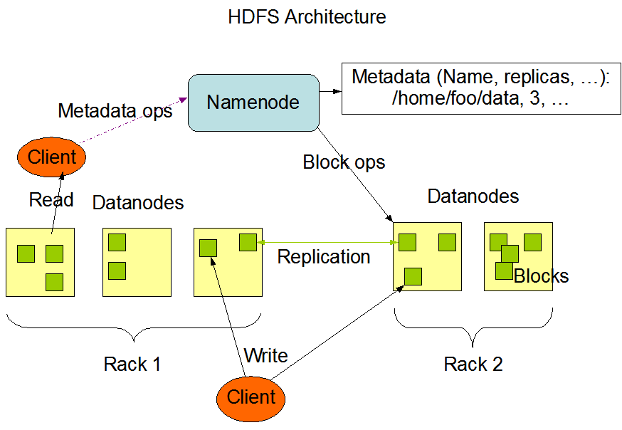

参考 大数据技术原理与应用(第二版) 林子雨

## 大数据概述
- 大数据时代
    - 第三次信息化浪潮
        - 个人计算机
        - 互联网
        - 物联网、云计算和大数据
    - 技术支撑
        - 存储设备
        - CPU处理能力
        - 网络带宽
    - 数据产生方式的变革
        - 运营式系统
        - 用户原创内容
        - 感知式系统
    - 发展历程
        - 萌芽期
        - 成熟器：`GFS` + `MapReduce`
        - 大规模应用期
- 大数据概念
    - 数据量大
    - 数据类型繁多
    - 处理速度快
    - 价值密度低
- 大数据的影响
    - 科学研究
        - 实验科学
        - 理论科学
        - 计算科学
        - 数据密集型科学
    - 思维方式
        - 全样而非抽样
        - 效率而非精确
        - 相关而非因果
    - 社会发展
        - 决策方式
        - 信息技术与各行业的深度融合
        - 新技术和新应用的不断涌现
- 大数据的应用
- 关键技术
    - 数据采集与预处理：`Flume` `Kafka`
    - 数据存储和管理：`HDFS` `HBase`
    - 数据处理与分析：`MapReduce` `Hive`
    - 数据可视化：`Easel.ly` `D3`
    - 数据安全和隐私保护
- 计算模式 
    - 批处理计算：`MapReduce` `Spark`
    - 流计算: `Storm` `Spark Streaming` `Flink`
    - 图计算: `Pregel` `GraphX`
    - 查询分析计算: `Dremel` `Hive`
- 大数据产业
    - IT基础设施层
    - 数据源层
    - 数据管理层
    - 数据分析层
    - 数据平台层
    - 数据应用层
- 大数据与云计算、物联网
    - 云计算
        - 服务
            - IaaS
            - PaaS
            - SaaS
        - 技术
            - 虚拟化
            - 分布式存储
            - 分布式计算
            - 多租户
    - 物联网
        - 感知层：二维码、RFID、传感器
        - 网络层：网络与通信技术
        - 处理层：数据挖掘与融合
        - 应用层：智能家居
    - 关系：相互促进、相互影响、相互融合

## 大数据处理架构
- Hadoop
    - 概述
        - 核心：`HDFS` + `MapReduce`
    - Hadoop生态系统 
        - HDFS 
            - 数据块(blocks):读写单位
            - 节点
                - 名称节点：命名空间
                - 数据节点：工作节点
                - 第二名称节点：缩减名称节点重启时间、保存名称节点的元数据信息
            - 体系结构：Master/Slave
            - 存储原理
                - 冗余存储
                - 存取策略
                - 数据错误与恢复
            - 数据读写过程
        - HBase 
            - 数据模型
                - 概念：表、行、列族、列限定符、单元格、时间戳
                - 数据坐标
                - 概念视图
                - 物理视图
                - 面向列的储存
            - 实现原理
            - 运行机制
        - MapRuduce 
            - 分布式并行编程: `map` + `reduce`
        - 资源管理调度框架YARN 
        - Pig：ETL过程
        - Tez：计算框架
        - Kafka：消息系统
- Spark 
    - 基本概念
        - 弹性分布式数据集：RDD(内存)
        - 有向无环图：DAG
        - Executor
- Flink: 低延迟、高吞吐、统一的大数据计算引擎

- Storm: 分布式的，可靠的，容错的数据流处理系统

- Pregel: 用于分布式图计算的计算框架

- 数据可视化
