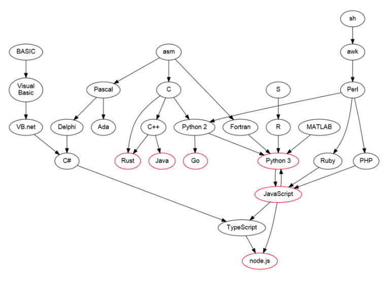

## 内容介绍
- 编程语言
    - 演化史 
        - 机器语言
        - 汇编语言
        - C/C++: 函数/面向对象, 需要指针, 需要人为去管理内存
        - Java: 跨平台, 无指针
        - [JavaScript](https://github.com/syntomic/Languages_and_Algorithms/tree/master/languages/javascript/): 事件驱动型, 单线程执行
        - [Python](https://github.com/syntomic/Languages_and_Algorithms/tree/master/languages/python/): 优雅, 简单, 明确
        - Golang: 海量并行
    - 类型
        - 强类型 vs 弱类型
        - 静态 vs 动态
        - 解释型 vs 编译型
    - 编程范式
        - 面向过程编程
        - 面向对象编程
        - 函数式编程
        - 面向消息编程
- 数据结构与算法
    - 程序 = 数据结构 + 算法
        - 数据结构: 数据之间的关联和组合形式
            - 抽象层: 逻辑结构
                - 集合
                - 线性
                - 树
                - 图
            - 存储层: 物理结构
                - 顺序结构
                - 链式结构
                - 索引结构
                - 散列结构
            - 实现层: 运算结构
                - 分配资源, 建立结构, 释放资源
                - 插入和删除
                - 获取和遍历
                - 修改和排序
        - 算法: 计算过程的严格描述
            - 算法设计
                - 枚举法
                - 分治法
                - 搜索法
                - 动态规划
            - 算法分析: 时间复杂度 vs 空间复杂度
    - 课程
        - [Algorithms-illuminated](https://lagunita.stanford.edu/courses/course-v1:Engineering+Algorithms1+SelfPaced/about): Stanford Algorithm Course
            - [Notes](https://github.com/syntomic/Languages_and_Algorithms/tree/master/algorithms/algorithms_illuminated/)
        - [数据结构与算法-Python语言描述](https://github.com/syntomic/Languages_and_Algorithms/tree/master/algorithms/data_structures_and_algorithms_in_python/)

