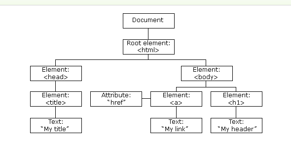

## JavaScript
- 基本语法: ES6 标准
    - 数据类型(动态)和变量
        - Number: `3 3.14 3e2`
        - String: `"hellp, world"`
        - Boolean: `true false`
            - `===`:不会转换数据类型
            - `NaN`:`isNaN(NaN)`
        - Undefined vs Null: 声明 vs 清空
        - Array: `cars = ["Saab","Volvo","BMW"]`
            - `cars.length`赋一个新的值会大小的变化
        - 集合型: `Map` ` Set`
        - Object: `person={firstname:"John", lastname:"Doe", id:5566}`
            - `hasOwnProperty`
        - 变量: `var name="zhouh"` vs `var name=new String("zhouh")`
            - 严格模式: `use strict`
    - 语句
        - 条件语句:`if (condition) {} else {}`
        ```javascript
        const condition = 2
        let obj = {
        '1' : () => { document.write(1) },
        '2' : () => { document.write(2) },
        '3' : () => { document.write(3) },
        }

        obj[condition]()
        ```
        - switch语句: `switch`+`case` 
        - 循环
            - for循环:`for (var i=0;i<3;i++) {}`
            - for/in循环:`for (item in items) {}`
            - (do)while循环
            - `break` vs `continue`
    - iterable(遍历元素)
        - `for of` vs `for in` : `for in`遍历对象的属性名称
        - `forEach(function () {})`
    - 其他
        - 关键字:`typeof` `this` `const`
        - 类型转换:`String(123)` `(123).toString()`
        - 弱类型: `5+'5'`
        - 分隔语句:`;`
        - 注释:`//` `/* */`
        - 大小写敏感: `getElementById`(驼峰法)
        - 正则表达式:`/正则表达式主体/修饰符(可选)`
        - 错误:`throw` `try catch finally`
        - json:`JSON.parse(text)` `JSON.stringify()`
        - 无返回值: `javascript:void(0)`
- 函数: `function myFunction(a, b) { return a*b }`
    - 参数:`arguments` `---rest`
    - `return`:行末自动添加分号
    - 变量提升:提升变量的声明,不提升变量的赋值
    - 名字空间:自己的所有变量和函数全部绑定到一个全局变量(jQuery)
    - 解构赋值
    - 方法:`this`
        - 装饰器`apply()`:统计一下代码一共调用了多少次函数,自定义函数代替原函数
    - 高阶函数
        - `map/reduce`
    - 闭包:函数作为返回值,返回函数不要引用任何循环变量，或者后续会发生变化的变量
        - 闭包就是携带状态的函数，并且它的状态可以完全对外隐藏起来
        ```javascript
        var add = (function () {
            var counter = 0;
            return function () {return counter += 1;}
        })();
        
        add();
        add();
        add();
        
        // 计数器为 3
    - 匿名函数:`x => x * x`
- 面向对象:`__proto__`
    - 原型对象:`prototype`
    - 创建与继承
- 浏览器: `window`
    - 用法：`<script></script>`
        - body中
        - head中
        - 引用：`<script src="myScript.js></script>"`
    - DOM 
        - 对象:`Collection` vs `Nodelist`
        - 操作节点: `appendChild()`
            - 更新
            - 遍历
            - 添加
            - 删除
    - 事件：`<p onclick="JavaScript">`
        - EventListener:`element.addEventListener(event, function, useCapture);`
    - 显示数据
        - 警告框：`window.alert()`
        - HTML文档：`document.write()`
        - 写入：`innnerHTML`
        - 控制台：`console.log()`
    - 实现功能
        - 表单验证:`document.forms["myForm"]["fname"].value;`
        - 验证API:`checkValidity()`
    - AJAX
    - Promise: 承诺将来会执行的对象
    - Canvas: 不再需要Flash
- 错误: `throw` `try catch finally`
    - 程序逻辑不对,导致代码执行异常
    - 执行过程中，程序可能遇到无法预测的异常情况而报错，例如，网络连接中断，读取不存在的文件，没有操作权限等
- JQuery `$(selector).func(context)`
    - 消除浏览器差异
    - 简洁的操作DOM方法 `$('div:hidden')`
    - 轻松实现动画,修改CSS
- underscore: 统一实现操作 `_.map()`
- Node.js:利用异步IO