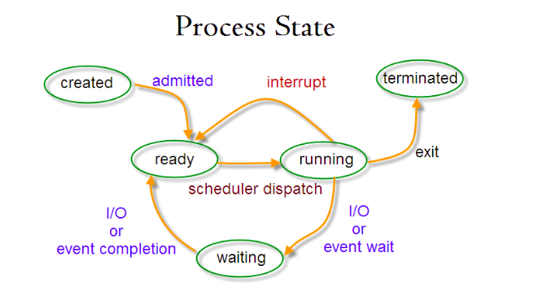

<p align="right">参考 操作系统真象还原 郑钢</p>

## 一些问题
- 是什么
    - 重复性劳动集中在一起
- 从哪里开始
    - 假定给硬件一个输入，硬件就会返回一个输出
- 写操作系统，哪些需要我来做
    - 分层
    - 了解硬件
- 软件如何访问硬件
    - 将某个外设的内存映射到一定范围的地址空间中
    - 通过I/O接口与CPU通信
- 应用程序是什么
    - 语言
    - 编译器
- 什么是陷入内核
    - 用户程序访问系统资源
- 内存访问为什么要分段
    - 两个编译出来地址相同的程序无法同时运行
    - 段基址+段内偏移地址：程序中指令的地址改为另外一个地址，但该地址的内容不变
- 代码中为什么分为代码段、数据段
    - 给他们赋予不同的属性
    - 提高CPU内部缓存的命中率
    - 节省内存
- 地址的区别：
    - 物理
    - 有效(逻辑)
    - 线性(虚拟)
- 什么是段重叠
- 什么是平坦模型
- cs、ds这类的serg段寄存器，位宽是多少
- 什么是工程
    - 开发一套软件所需要的全部文件
        - 实际代码
            - 自己
            - 同事
            - 第三方
        - 环境配置
            - 模板
            - 库文件目录
            - 服务器地址
- 为什么不同系统上应用软件不能兼容
    - 可执行程序格式不一致
    - API不同
- 局部变量和函数参数为什么要放在栈中
    - 浪费空间
- 为什么说汇编语言比C语言快
    - 高级语言为了通用性，需要加入额外代码
- 先有的语言还是先有的编译器
    - 先有编程语言
    - 第一本书是怎么产生的：人的记忆
- 编译型程序与解释型(脚本)程序的区别
    - 脚本中的代码不会在CPU上执行
    - CPU眼中只有脚本解释器
- 什么是大端字节序、小端字节序
- BIOS终端、DOS中断、Linux中断的区别
- section和Segment的区别
- 什么是魔数
    - 出现一个数字，不明白其意思，但结合上下文就明白了
- 操作系统如何识别文件系统
    - 文件系统的魔数
- 如何控制CPU的下一条指令
    - 程序计数器
- 指令集、体系结构、微架构、编程语言
    - 指令集：具体的一套指令编码
    - 微架构：指令集的物理实现方式
- 库函数是用户进程与内核的桥梁
- 转义字符与ASCII码
- MBR、EBR、DBR、OBR各是什么
    - 计算机系统的控制权
- 历史背景
        - 史前时代
        - 电子管时代
            - ENIAC: 占地170平方米, 重达30吨, 耗电功率150千瓦每时, 每秒5000次运算
        - 晶体管时代
        - 集成电路时代
        - 人工智能, 大数据和云计算的结合
    - 指令系统: 机器指令的操作类型、格式、寻址
    - 存储系统: 多级存储层次、虚拟存储器结构、高速缓冲存储器结构及存储保护
    - 输入输出系统: 通道结构、输入输出处理机结构
    - 中央处理机结构: 包括冯·诺依曼结构、非冯·诺依曼结构、重叠结构、流水结构、并行处理结构
    - 多机系统: 互连技术，多处理机结构、分布处理结构、计算机网络结构
    - 人机通信联系: 人-机接口、计算机可靠性、可用性和可维护性(这三者称为RAS技术)、容错技术、故障诊断
## 接下来
- 部署工作环境
- 编写MBR主引导记录
- 保护模式入门
- 保护模式进阶，向内核迈进
- 完善内核
- 中断
- 内存管理系统
- 线程
- 输入输出系统
- 用户进程
- 进一步完善内核
- 编写硬盘驱动程序
- 文件系统
- 系统交互

## 总结
- 操作系统
    - 基本特征
        - 并发:一段时间内同时运行多个程序,操作系统通过引入进程和线程实现
        - 共享:系统中资源可以被多个并发进程共同使用 互斥vs同时
        - 虚拟:物理实体转换为多个逻辑实体
            - 时分复用:多进程在同一处理器
            - 空分复用:虚拟内存,物理内存抽象为地址空间
        - 异步:进程不一次性执行完毕
    - 基本功能
        - 进程管理
            - 进程与线程: 拥有资源,调度,系统开销,通信方面
                - 进程:资源分配的基本单位
                - 线程:独立调度的基本单位
            - 进程状态的切换 
                - 就绪(ready):等待被调度
                - 运行(running):CPU时间
                - 阻塞(waiting):等待资源
            - 进程调度算法
                - 批处理系统:保证吞吐量和周转时间
                    - 先来先服务(FCFS)
                    - 短作业优先(SJF)
                    - 最短剩余时间优先(SRTN)
                - 交互式系统:快速响应
                    - 时间片轮转
                    - 优先级调度
                    - 多级反馈队列
                - 实时系统:请求在一个确定时间内得到响应
            - 进程同步: 目的
                - 临界区:对临界资源进行访问的代码
                - 同步与互斥
                    - 同步:多个进程因为合作产生的直接制约关系,使进程有一定的先后执行关系
                    - 互斥:多个进程在同一时间只有一个经常能进入临界区
                - 信号量(Semaphore):整型变量,可对其执行`down`和`up`操作,唤醒进程/进程睡眠
                    - 使用信号量实现生产者-消费者问题
                    ```c
                    #define N 100
                    typedef int semaphore;
                    semaphore mutex = 1;
                    semaphore empty = N;
                    semaphore full = 0;

                    void producer() {
                        while(TRUE) {
                            int item = produce_item();
                            down(&empty);
                            down(&mutex);
                            insert_item(item);
                            up(&mutex);
                            up(&full);
                        }
                    }

                    void consumer() {
                        while(TRUE) {
                            down(&full);
                            down(&mutex);
                            int item = remove_item();
                            consume_item(item);
                            up(&mutex);
                            up(&empty);
                        }
                    }
                    ```
                - 管程:把控制的代码独立出来, 更容易实现生产者-消费者问题
                - 同步问题
                    - 读者-写者问题:允许多个进程对数据进行读操作,但不能读和写以及写和写操作同时发生
                    - 哲学家进餐问题:吃饭和思考
            - 进程通信:进程间传输信息
                - 管道:半双工通信(单向交替传输),父子进程或兄弟进程中使用
                - 命名管道FIFO:去除管道只能在父子进程中使用的限制, 用作汇聚点
                - 消息队列
                    - 可以独立于读写进程存在，避免了FIFO中同步管道的打开和关闭时可能产生的困难
                    - 避免了FIFO的同步阻塞问题，不需要进程自己提供同步方法
                    - 读进程可以根据消息类型有选择地接收消息，而不像FIFO那样只能默认地接收
                - 信号量: 计数器,用于多个进程提供对共享数据对象的访问
                - 共享存储: 最快的IPC
                - 套接字: 不同机器间的进程通信
        - 内存管理
            - 虚拟内存:物理内存扩充成更大的逻辑内存，从而让程序获得更多的可用内存
                - 页:地址空间分割的每一块
            - 分页系统地址映射:页表存储页(程序地址空间)和页框(物理内存空间)的映射表 
            - 页面置换算法:使页面置换频率(缺页率)最低
                - 最佳(OPT):所选择的被换出的页面将是最长时间内不再被访问(理论)
                - 最近最久未使用(LRU):虽然无法知道将来要使用的页面情况，但是可以知道过去使用页面的情况
                    - 维护一个所有页面的链表,页面被访问就移到表头
                - 最近未使用(NRU):优先换出已经被修改的脏页面
                - 先进先出(FIFO):选择换出的页面是最先进入的页面
                - 第二次机会算法:避免经常使用的页面置换出去,链表中移动页面
                - 时钟:使用环形链表将页面连接起来，再使用一个指针指向最老的页面
            - 分段:每个表分成段，一个段构成一个独立的地址空间
            - 段页式:程序的地址空间划分成多个拥有独立地址空间的段，每个段上的地址空间划分成大小相同的页
            - 分页和分段的比较
                - 对程序员的透明性:分页透明，但是分段需要程序员显式划分每个段
                - 地址空间的维度:分页是一维地址空间，分段是二维的
                - 大小是否可以改变:页的大小不可变，段的大小可以动态改变
                - 出现的原因:分页主要用于实现虚拟内存，从而获得更大的地址空间；分段主要是为了使程序和数据可以被划分为逻辑上独立的地址空间并且有助于共享和保护
        - 文件管理
            - 磁盘结构
            - 磁盘调度算法
                - 先来先服务
                - 最短寻道时间优先
                - 电梯算法
        - 设备管理
            - 磁盘结构 
            - 读写磁盘块的时间
                - 旋转时间:主轴转动盘面，使得磁头移动到适当的扇区上
                - 寻道时间:制动手臂移动，使得磁头移动到适当的磁道上(最长)
                - 实际数据传输时间:
            - 磁盘调度算法
                - 先来先服务FCFS:按照磁盘请求的顺序进行调度
                - 最短寻道时间优先SSTF:优先调度与当前磁头所在磁道距离最近的磁道
                - 电梯算法SCAN:总是保持一个方向运行，直到该方向没有请求为止，然后改变运行方向
        - 系统调用
    - 内核
        - 大内核:操作系统功能作为一个紧密结合的整体放到内核
        - 微内核:操作系统被划分成小的,定义良好的模块(内核态和用户态)
    - 中断
        - 外中断:由CPU执行指令之外的事件引起,如I/O完成中断
        - 异常:由CPU执行指令的内部事件引起,如算术溢出
        - 陷入:用户程序中使用系统调用
    - 死锁
        - 必要条件 
            - 互斥:每个资源要么已经分配给了一个进程，要么就是可用的
            - 占用和等待:已经得到了某个资源的进程可以再请求新的资源
            - 不可抢占:已经分配给一个进程的资源不能强制性地被抢占，它只能被占有它的进程显式地释放
            - 环路等待:有两个或者两个以上的进程组成一条环路，该环路中的每个进程都在等待下一个进程所占有的资源
        - 处理方法
            - 鸵鸟策略:把头埋在沙子里，假装根本没发生问题
            - 死锁检测与死锁恢复:不试图阻止死锁，而是当检测到死锁发生时，采取措施进行恢复
                - 每种类型一个资源的死锁检测:检测有向图是否存在环
                - 每种类型多个资源的死锁检测:任何没有被标记的进程都是死锁进程
                - 死锁恢复
                    - 利用抢占恢复
                    - 利用回滚恢复
                    - 通过杀死进程恢复
            - 死锁预防:程序运行之前预防发生死锁
                - 破坏互斥条件:允许若干个进程同时输出
                - 破坏占有和等待条件:规定所有进程在开始执行前请求所需要的全部资源
                - 破坏不可抢占条件
                - 破坏环路等待:给资源统一编号，进程只能按编号顺序来请求资源
            - 死锁避免:在程序运行时避免发生死锁
                - 安全状态:如果没有死锁发生，并且即使所有进程突然请求对资源的最大需求，也仍然存在某种调度次序能够使得每一个进程运行完毕
                - 单个资源的银行家算法:判断对请求的满足是否会进入不安全状态
                - 多个资源的银行家算法
    - 链接
        - 编译系统 
            - 预处理阶段:处理以#开头的预处理命令
            - 编译阶段:翻译成汇编文件
            - 汇编阶段:将汇编文件翻译成可重定位目标文件
            - 链接阶段:将可重定位目标文件和单独预编译好的目标文件进行合并，得到最终的可执行目标文件
        - 目标文件
              - 可执行目标文件:可以直接在内存中执行
              - 可重定向目标文件:可与其它可重定位目标文件在链接阶段合并，创建一个可执行目标文件
              - 共享目标文件:这是一种特殊的可重定位目标文件，可以在运行时被动态加载进内存并链接
        - 静态编译:以一组可重定位目标文件为输入，生成一个完全链接的可执行目标文件作为输出
            - 符号解析:将每个符号(函数,变量)引用与一个符号定义关联起来
            - 重定位:把每个符号定义与一个内存位置关联起来,然后修改对符号的引用,使其指向内存位置
        - 动态链接:`.so`(Linux) `DLL`(Windows)
            - 静态库更新时整个程序需要重新进行链接
            - 若每个程序需要标准函数库中代码,造成极大的资源浪费
