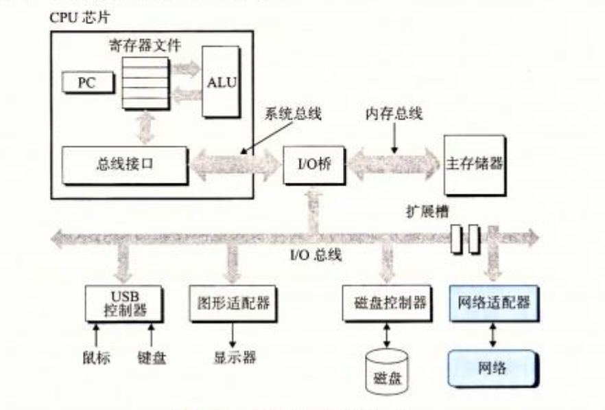
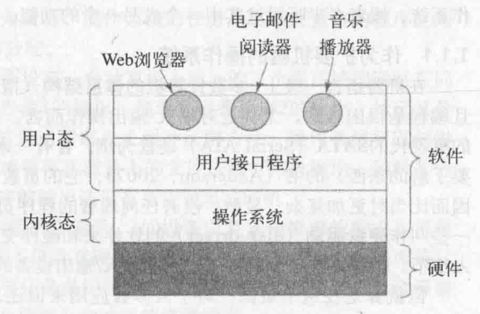
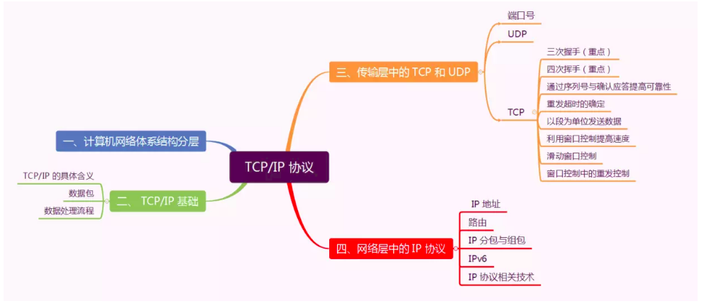

## 内容介绍
- 计算机系统: 硬件和软件
    - 信息: 位 + 上下文
    - 程序被其他程序翻译成不同的格式: 编译系统
    - 处理器读并解释存在内存中的指令: 运行程序
    - 存储设备形成层次结构: 上一层的存储器作为低一层的高速缓存
    - 操作系统管理硬件
        - 虚拟机
        - 进程
        - 虚拟内存
        - 文件
    - 系统之间利用网络通信 
    - 并发和并行
        - 计算机做得更多
        - 计算机运行得更快
- [操作系统](OS/os.md): 管理计算机硬件与软件资源的计算机程序 
    - 观点
        - 资源管理: 有效管理系统的各个部分
        - 扩展的机器: 为用户提供比实际机器更便于运用的抽象
    - 硬件: 处理器 存储器 I/O设备组成, 并通过总线连接
    - 基本概念
        - 进程管理
        - 设备管理
        - 内存管理
        - 文件管理
        - 安全
    - 常见系统
        - Windows
        - MacOS
        - [Linux系统](OS/Linux/linux.md)
            - 开源世界
- [计算机网络](network/network.md) 
    - 基础结构发展的三个阶段
        - 单个网络ARPANET向互连网(internet)发展
            - 互联网(Internet)：互连网+TCP/IP协议
        - 三级结构的互联网(NSFNET):主干网,地区网,校园(企业)网
        - 多层次ISP结构的互联网: 主干ISP, 地区ISP, 本地ISP
    - 体系结构:
        - 分层结构: 复杂问题转化为简单问题
        - 网络协议: 语法 + 语义 + 同步
    - 5G
        - 极高频/毫米波
        - 微基站
        - Massive MIMO天线
        - 波束赋形
        - D2D
    - 科学上网
        - Host
        - VPN
        - SSR
    - 虚拟机实现桥接连接
