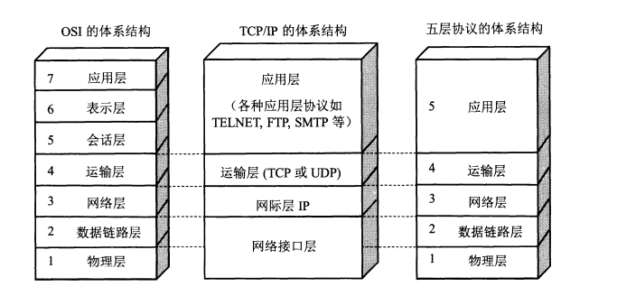
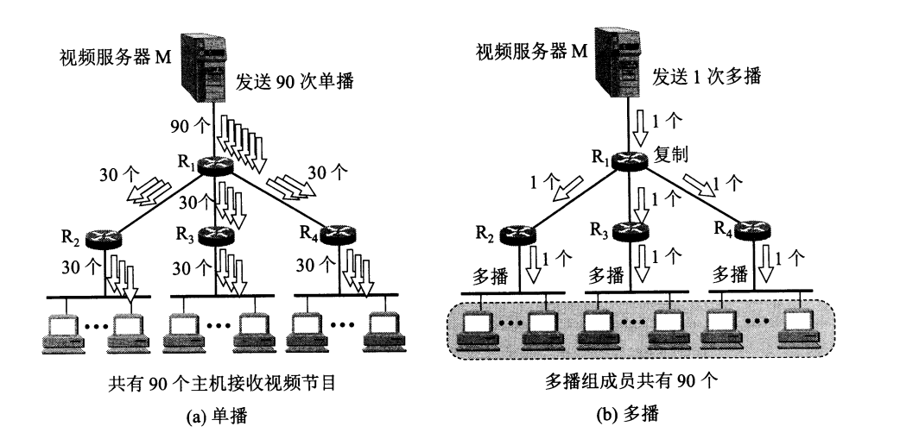
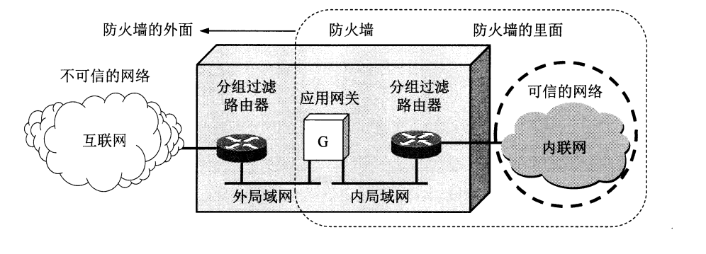

参考 计算机网络(第7版) 谢希仁

## 概述

- 计算机网络在信息时代的作用:连通性与资源共享
- 互联网概述
    - 网络的网络
        - 网络：节点+链路
        - 互连网(internet)：网络+路由器+网络
    - 基础结构发展的三个阶段
        - 单个网络ARPANET向互连网发展
            - 互联网(Internet)：互连网+TCP/IP协议
        - 三级结构的互联网(NSFNET):主干网,地区网,校园(企业)网
        - 多层次ISP结构的互联网
            - 层次
                - 主干ISP
                - 地区ISP
                - 本地ISP
            - 互联网交换点IXP：网络直接相连并交换分组
            - 万维网(WWW):方便非网络专业人员对网络的使用
    - 标准化工作：建议标准到互联网标准(RFC)
- 互联网的组成
    - 边缘部分
        - 端系统通信：两主机之间的通信进程
            - 客户-服务器方式(C/S)
            - 对等方式(P2P)
    - 核心部分
        - 电路交换:按某种方式动态地分配传输线路的资源,始终占用端到端的通信资源
        - 分组交换(packet switching):储存转发(路由器)
- 计算机网络在我国的发展
- 计算机网络的类型
    - 定义：通用、可编程硬件互连而成，支持广泛应用
    - 几种不同类别
        - 作用范围
            - 广域网(WAN)
            - 城域网(MAN)
            - 局域网(LAN)
            - 个人区域网(PAN)
        - 使用者
            - 公用网
            - 专用网
        - 用户接入到互联网
            - 接入网(AN)：某个用户端系统到互联网中的第一个路由器
- 计算机网络的性能
    - 性能指标
        - 速率: 数据的传送速率
        - 带宽：单位时间某信道所能通过的最高数据率
        - 吞吐量：单位时间内通过某个网络的实际数据
        - 时延 
            - 发送时延:主机或路由器发送数据帧所需要的时间
                - 高速网络
            - 传播时延:电磁波在信道中传播一定距离需要花费的时间
                - 光纤信道：高速率向光纤信道发生数据，传播速率比铜线略低
            - 处理时延:主机或路由器在收到分组时要花费一定的时间进行处理
            - 排队时延:分组进入路由器后要先在输入队列中排队等待处理
        - 时延带宽积：传播时延*带宽
        - 往返时间RTT:双向交互
        - 利用率过高会产生非常大的时延
            - 信道利用率
            - 网络利用率
    - 非性能指标
        - 费用
        - 质量
        - 标准化
        - 可靠性
        - 可扩张性和可升级性
        - 易于管理和维护
- 计算机网络体系结构
    - 形成：OSI到TCP/IP(商业)
    - 协议与划分层次：OSI(七)，TCP/IP(四)
        - 体系结构
            - 网络协议
                - 语法:数据与控制信息的结构或格式
                - 语义:需要发出何种控制信息,完成何种动作以及做出何种响应
                - 同步:事件实现顺序的详细说明
            - 分层优点
                - 各层独立
                - 灵活性好
                - 结构可分割开
                - 易于实现和维护
                - 促进标准化工作
            - 各层功能
                - 差错控制
                - 流量控制
                - 分段和重装
                - 复用和分用
                - 连接建立和释放
    - 具有五层协议的体系结构：综合OSI和TCP/IP的优点 
        - 应用层：应用进程间的通信和交互的规则 DNS, HTTP, SMTP
        - 运输层：负责两台主机进程之间的通信提供通用的数据传输服务 TCP, UDP
        - 网络(际)层: 为分组交换网上的不同主机提供通信服务
            - 网际协议：IP
            - 路由选择协议
        - 数据链路层：将网络层交下来的IP数据报组装成帧(framing),在两个相邻结点间的链路上传送帧
        - 物理层：传输比特,电压代表"1"和"0" 
    - 实体、协议、服务、服务访问点
        - 实体(entity)：任何发送或接收信息的硬件或软件进程
        - 协议：控制两个对等实体进行通信的规则集合
        - 服务
            - 本层向上一层提供服务
            - 本层协议使用下面一层所提供的服务
        - 服务访问点(SAP)：相邻两层的实体进行交互的地方
    - TCP/IP的体系结构：技术的发展并不是遵循严格的分层概念 
## 物理层
- 基本概念：传输数据比特流，而不是具体的传输媒体
- 数据通信的基础知识 
    - 数据通信系统的模型 
        - 组成
            - 源系统
            - 传输系统
            - 目的系统
        - 信号
            - 模拟(连续)
            - 数字(离散)
                - 码元: 代表不同离散数值的基本波形
    - 信道的基本概念：向某一方向传送信息的媒体
        - 交互方式
            - 单向(单工)通信
            - 双向(半双工)通信
            - 双向同时(双全工)通信
        - 基带信号:来自信源的信号
            - 调制:将基带信号的低频分量或直流分量转化为信道能够传输的信号
                - 编码:数字模式转换为另一种数字模式 
                - 载波(carrier):频率范围搬移到较高的频段,并转换为模型信号
    - 信道的极限容量:让一个码元携带更多比特的信息量(Shannon公式)
        - 信道能够通过的频率范围
        - 信噪比
- 传输媒体:数据传输系统中在发送器和接收器之间的物理通信 
    - 引导型:电磁波被导引沿着固体媒体(铜线或光纤)传播
        - 双绞线
        - 同轴电缆
        - 光缆:光纤通信
    - 非引导型:自由空间(无线传输)
        - 短波通信(高频通信)
        - 无线电微波通信
            - 地面微波接力通信
            - 卫星通信:较大的传播时延
        - 无线移动通信
- 信道复用技术：共享信道 
    - 频分复用、时分复用、统计时分复用
    - 波分复用
    - 码分复用:码分多址CDMA
- 数字传输系统：数字信息时代
    - 速率标准
    - 同步传输
- 宽带接入技术：接入互联网速率大于一定标准
    - ADSL技术:利用数字技术对现有的模拟电话用户线进行改造 
    - 光纤同轴混合网(HFC网):有线电视的基础上开发 
    - FTTx技术:理想情况，光纤到户(FTTH)
## 数据链路层
- 使用点对点信道:一对一
    - 数据链路和帧 
        - 数据链路：链路+协议
        - 协议数据单元：帧
    - 三个基本问题
        - 封装成帧：首部+数据+尾部
        - 透明传输：文本(ASCII)透明 二进制需要转义
        - 差错检测：循环冗余检验CRC
            - 无比特差错 vs 无传输差错
            - 对通信质量良好的有线传输链路,数据链路层不使用确认和重传机制
    - 具体实现: 点对点协议PPP(用户计算机和ISP通信)
        - 特点:简单
        - 组成
            - IP数据报封装到串行链路的方法
            - 链路控制协议(LCP)
            - 网络控制协议(NCP)
        - 帧格式 
        - 工作状态:PPP链路状态
- 使用广播信道:一对多
    - 局域网:单位拥有,地理范围和站点数目均有限
        - 以太网(Ethernet)：802.3局域网
            - ~~逻辑链路控制LLC~~
            - 媒体接入控制MAC
        - 适配器(网卡)：过滤功能，**中断**  
            - 与局域网：双绞线，串行  
            - 与计算机：主板上的I/O总线，并行
    - 载波监听多点接入/碰撞(CSMA/CD)协议：广播特性的总线上实现一对一通信(半双工)
        - 无连接:尽最大努力交付
        - 使用Manchester编码:从收到的比特流中提取同位(比特同步)信号
    - 使用集线器(hub)的星形拓扑 
    - 以太网的信道利用率:发生碰撞+占用信道时间
    - 以太网的MAC层:接口的标识符
        - 硬件地址：计算机固化在适配器的ROM中的48位地址
        - 混杂方式：hacker或提升网络性能
        - MAC帧 
- 扩展的以太网
    - 物理层扩展：多个集线器
    - 数据链路层扩展：网桥到交换机，双全工
        - 特点:独占传输媒体,无碰撞地传输数据
        - 帧交换表(地址表):自学习算法 
        - 从总线以太网到星形以太网:双全工
    - 虚拟局域网(VLAN)：与物理地址无关的逻辑组
        - 802.1Q: 插入VLAN标记的帧
- 高速以太网
    - 100BASE-T以太网
    - GE
    - 10GE和更快
    - 使用以太网进行宽带接入: PPP over Ethernet(PPPoE)
## 网络层
- 两种服务:可靠交付应当由谁来负责?是网络还是端系统? 
    - 面向连接：电信网
    - 无连接：网络层向上只提供简单灵活的、无连接的、尽最大努力交付的数据报服务
- 网际协议IP：ICMP+IGMP+IP+ARP
    - 中间设备
        - 物理层:转发器(repeater)
        - 数据链路层:网桥或桥接器(bridge)
        - 网络层:路由器(router)
        - 网络层以上:网关(gateway)
    - 虚拟互连网络(intenet) 
    - 分类的IP地址(RFC 791)
        - IP地址及其表示方法：网络号+主机号(32位) 
        - 特殊IP地址
            - 本网络：0.0.0.0
            - 环回测试：127.
        - 特点
            - 标志一台主机(路由器)和一条链路的接口：路由器至少有两个不同的IP
            - 用转发器或网桥连接起来的若干个局域网仍为一个网络
            - 所有分配到网络号的网络都是平等的
    - IP地址与硬件地址 
        - 逻辑地址:软件实现
    - 地址解析协议ARP:由IP地址找相应的硬件地址 
        - ARP高速缓存:IP地址到硬件地址的映射表,有生存时间,同一局域网
    - IP数据报格式 
        - MTU:数据帧中的数据字段的最大长度
    - IP层转发分组流程 
        - 特定主机路由:对特定的目的主机指明一个路由
        - 默认路由(default route)
        - 分组转发算法
            - 从数据报的首部提取目的主机的IP地址,得到目的网络地址
            - 直接交付(把目的主机地址转换为具体的硬件地址,封装成帧)或间接交付
            - 若路由表有目的地址的特定主机路由,则把数据报传送给路由表所指明的下一跳路由器
            - 若路由表有到达网络的路由SSL,则把数据表传送给路由表所指明的下一挑路由器
            - 若路由表有一个默认路由,则把数据表传送给路由表所指明默认路由器
            - 报告转发分组出错
- 划分子网和构造超网
    - 划分子网:增加了灵活性,但却减少了能够连接在网络的主机总数
        - 两级到三级:网络号+子网号+主机号
        - 子网掩码：IP地址+子网掩码=子网网络地址
    - 使用子网时分组转发:目的主机IP地址+子网掩码与路由表中目的网络地址比较
    - 无分类编址CIDR(构造超网)：网络前缀/主机号 
        - 路由聚合(构造超网):利用CIDR地址来查找目的网络
        - 最长前缀匹配:匹配结果中选择具有最长网络前缀的路由
        - 二叉搜索查找路由表:快速在路由表中找到匹配的叶节点
            - 压缩技术
- 网际控制报文协议ICMP:允许主机或路由器报告差错情况和提供有关异常情况的报告,位于数据报的数据中
    - 种类
        - ICMP差错报告报文
            - 改变路由(重定向)
        - ICMP询问报文
            - 回送请求和回答
    - 应用举例：
        - 分组网间探测PING:测试两台主机之间的连通性
        - traceroute:跟踪一个分组从源点打终点的路径
- 互联网的路由选择协议:
    - 理想的路由算法:正确,简单,自适应,稳定,公平,最佳
    - 分层次的路由选择协议:互联网划分成许多较小的自治系统(AS) 
        - 内部网关(路由)协议IG(R)P
            - 路由信息协议RIP:距离向量协议
            - 开放最短路径优先OSPF:链路状态协议,使用最短路径算法SPF
        - 外部网关(路由)协议EG(R)P
            - 边界网关协议BGP:路径向量选择协议,力求寻找能够到达目的网络且比较好的路由
    - 路由器的构成
        - 基本结构 
        - 交换结构:把分组从一个输入端口转移到某个合适的输出端口
- IPv6：128位(冒号十六进制)
    - 基本首部 
    - 地址
        - 单播
        - 多播
        - 任播:终点为一组计算机,但数据报只交付其中一个
    - IPv4到IPv6过渡:逐步演进的办法,向后兼容
        - 双协议栈
        - 隧道技术:把IPv6数据报封装成为IPv4数据报
    - ICMPv6:ARP和IGMP合并到ICMPv6中
- IP多播:实时信息交付 
    - 基本概念：在互联网上一对多的通信，目的地址，不能PING多播地址 
    - 局域网进行硬件多播
    - 网际组管理协议IGMP和多播路由选择协议
- 虚拟专用网VPN和网络地址转换NAT：
    - VPN：利用公用的互联网作为本机构各个专用网之间的通信载体 
        - 本地地址 vs 全球地址
        - 专用地址:只能用于一个机构的内部通信
        - 专用地址:专用IP地址的互连网络
        - 外联VPN,远程接入VPN
    - NAT：已分配本地IP，又想和互联网上的主机通信 
- 多协议标记交换MPLS:面向连接, IP增强技术，上层可采用多种协议，分组快 
    - 特点
        - 支持面向连接的服务质量
        - 支持流量工程，平衡网络负载
        - 有效地支持VPN
    - 工作原理
        - 标记交换路由器LSR：不用查路由表
        - 转发等价类FEC:路由器按照同样方式对待的IP数据报集合
    - 首部的位置和格式 
## 运输层
- 协议概述
    - 进程之间的通信 
        - 通信的真正端点并不是主机而是主机中的进程
        - 逻辑通信:好像这样通信,但事实上并非真的这样通信
    - 两个主要协议：
        - 用户数据报协议UDP：无连接
        - 传输控制协议TCP：面向连接
    - 端口(16位)：复用 分用 
        - 服务器 
            - 熟知端口号：0~1023 
            - 登记端口号；1024~49151
        - 客户端
            - 短暂端口号：49152~65535
- 用户数据报协议UDP
    - 概述
        - 无连接
        - 尽最大努力交付
        - 面向报文:保留报文的边界
        - 无拥塞控制
        - 支持一对一,一对多,多对一,多对多交互通信
        - 首部开销小
    - 首部格式：
        - 伪首部:计算检验和,把首部和数据部分一起检验 
- 传输控制协议TCP
    - 主要特点
        - 面向连接
        - 只能有两个端点:一对一
        - 可靠交付的服务
        - 全双工通信:设有缓存
        - 面向字节流 
    - 连接
        - 套接字(socket)：`IP:port`
- 可靠传输的工作原理
    - 停止等待协议：等待确认再发送下个分组
        - 自动重传请求ARQ
            - 无差错情况或超时重传 
            - 确认丢失和确认迟到 
        - 信道利用率 RTT占比大 
            - 流水线传输:连续发送多个分组
    - 连续ARQ协议 
- TCP报文段的的首部格式：
    - 序号:字节流的每一个字节按顺序编号
    - 确认号N：N-1为止的所有数据都已正确收到
    - 控制位
        - 紧急URG: URG=1
        - 确认ACK：ACK=1
        - 推送PSH: PSH=1
        - 复位RST: RST=1
        - 同步SYN：SYN=1
        - 终止FIN: FIN=1
    - 窗口：明确指出现在允许对方发送的数据量,动态变化
- TCP可靠传输的实现
    - 以字节为单位的滑动窗口 
        - 缓存 
    - 超时重传时间的选择:规定时间内没有收到确认就要重传已发送的报文段
        - 自适应算法Karn 
    - 选择确认SACK 
        - 收到报文端未按序号，只传送缺少的数据
- TCP的流量控制：发送方的发送速率不要太快，要让接收方来得及接收
    - 利用滑动窗口 
        - 持续计时器:收到对发零窗口通知,就启动持续计时器
    - 传输效率
        - 控制TCP发送报文段的时机：Naggle算法
        - 糊涂窗口综合征：接收方等待+等待接收缓存
- 拥塞控制方法:防止过多的数据注入到网络中,使网络中的路由器或链路不致过载
    - 一般原理：对资源需求和大于可用资源
    - TCP的拥塞控制方法
        - 慢开始和拥塞避免
        - 快重传和快恢复
    - 主动队列管理AQM：避免全局同步现象(TCP连接在同一时间突然都进入到慢开始状态)
- TCP的连接确认
    - 连接建立(三次握手)：
    - 连接释放(四次握手)：
    - 有限状态机：
## 应用层
- 域名系统DNS
    - 概述：机器名字转换为IP地址
    - 互联网的域名结构：域名树 
        - 三级域名：pku
        - 二级域名
            - 类别：edu
            - 行政区：bj
        - 顶级域名
            - 国家：cn
            - 通用：org
            - 基础结构：arpa
    - 域名服务器 
        - 根域名
        - 顶级域名
        - 权限域名
        - 本地域名
    - DNS查询 
- 文件传送协议
    - FTP：TCP 
        - 复制整个文件
        - 联机访问：网络文件系统NFS
    - FTP的基本工作原理
    - 简单文件传送协议TFTP：UDP
- 远程终端协议TELNET：终端仿真协议 
- 万维网WWW:大规模的、联机式的信息储藏所，链接
    - 统一资源定位符URL：协议://主机:端口/路径
    - 超文本传送协议HTTP
        - 代理服务器(Web cache) 
    - 文档HTML：CGI脚本
    - 信息检索系统
        - 全文检索搜索(spider)：Google
        - 分类目录搜索
        - 垂直搜索
    - 应用
        - 博客和微博
        - 社交网站
- 电子邮件
    - 概述：
    - 简单邮件传送协议SMTP
    - 信息格式
    - 读取协议POP3和IMAP
    - 基于万维网的电子邮件
    - 通用互联网邮件扩充MIME：传送非ASCII码
- 动态主机配置协议DHCP：动态配置IP地址 
- 简单网络管理协议SNMP: 对硬件,软件和人力的使用,综合与协调 
    - 管理信息结构SMI
    - 管理信息库MIB
    - 协议数据单元和报文
- 应用间进程跨越网络的通信
    - 系统调用和应用编程接口
        - API：应用进程的控制权和操作系统的控制权进行转换的接口
            - Socket  
                - 并发:服务器同时处理多个连接 
    - 几种常用的系统调用
        - 连接建立阶段
        - 数据传送阶段
        - 连接释放阶段
- P2P应用:文件分发,不需要集中式的媒体服务器,在普通互联网用户之间传输
    - 具有集中目录服务器的P2P工作方式
    - 具有全分布式结构的P2P文件共享程序:BT(Bit Torrent)
    - 文件分发的分析
    - 对等方中搜索对象:分布式散列表DHT
## 网络安全
- 问题概述
    - 安全性威胁 
    - 安全的计算机网络:网络的安全性是不可判定的 
    - 数据加密模型 
- 两种密码体制
    - 对称密钥密码体制
    - 公钥密码体制
- 数字签名 
- 鉴别(authentication):验证通信的对方的确是自己所要通信的对象
    - 报文鉴别
        - 密码散列函数:单向函数
            - MD5和SHA-1
    - 实体鉴别
- 密钥分配
    - 对称密钥的分配:密钥分配中心KDC
    - 公钥的分配:认证中心CA(公钥与其对应的实体进行绑定)
- 安全协议
    - 网络层: IPsec
    - 运输层：SSL/TLS 
        - SSL安全会话建立 
    - 应用层: 为邮件提供安全服务的协议PGP
- 系统安全
    - 防火墙 
    - 入侵检测系统IDS
- 一些未来的发展方向
    - 椭圆曲线密码
    - 移动安全
    - 量子密码
## 互联网上的音频/视频服务
- 概述:多媒体信息的信息量很大,对时延和时延抖动均有较高的要求
- 流式存储音频/视频:便下载边播放 
    - 具有元文件的万维网服务器
    - 媒体服务器
    - 实时流式协议RTSP:媒体播放器能够控制多媒体流的传送
- 交互式音频/视频
    - IP电话:Voice over IP
    - 所需几种应用协议：
    - 实时运输协议RTP:为实时应用提供端到端的运输,但不提供任何服务质量的保证
    - 实时运输控制协议RTCP:服务质量的监视与反馈,媒体间的同步,多播组中成员标志
    - 信令标准
        - H.323
        - 会话发起协议SIP
- 改进"尽最大努力交付"的服务:不平等对待所有分组
    - 使互联网提供服务质量QoS
    - 调度和管制机制
    - 综合服务IntServ与资源预留协议RSVP
    - 区别服务DiffServ
## 无线网络和移动网络
- 无线局域网WLAN
    - 组成：
        - 有固定基础设施(基站)
            - IEEE 802.11(WIFI) 
        - 无固定基础设施
            - 移动自组网络 
                - 无线传感器网络WSN:物联网IoT
    - 802.11局域网
        - 物理层：802.11ah
        - MAC层协议
            - CSMA/CA(Collision Aviodance)协议:并非所有的站点都能够听见对方 
            - 对信道进行预约
        - MAC帧：
- 无线个人区域网WPAN
    - 蓝牙
    - 低速WPAN:ZigBee
    - 高速WPAN
- 无线城域网WMAN:802.16 
- 蜂窝移动通信网
    - 技术简介
        - 1G
        - 2G：GSM
        - 3G：CDMA2000, WCDMA, TD-SCDMA 
        - 4G：TD-LTE FDD-LTE
        - 5G：3GPP 5G SA
    - 移动IP：移动到外地，仍然保留其IP地址 
    - 对移动用户的路由选择:直接 vs 间接
    - GSM中的切换:移动用户与相关联的基站发生了改变
    - 无线网络对高层协议的影响:拆分TCP连接
- 无线上网比较：
