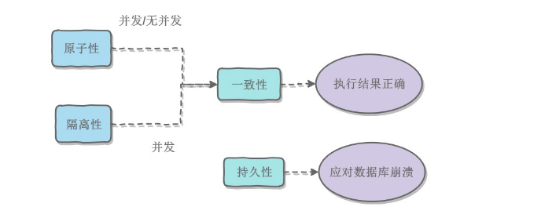
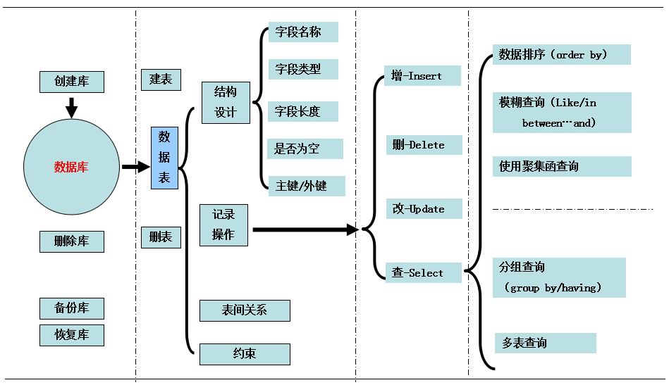

## 概述

- 从一个问题开始
    - 这是什么类型的数据库
    - 驱动力是什么
    - 如何与数据库交互
    - 每种数据库的独特性体现在哪里
    - 各种数据库的性能如何
    - 每个数据库的可伸缩性如何

- 风格
    - 关系数据库(RDBMS)：MySQL
    - 键-值数据库(Key-Value)：Redis
    - 列型数据库：HBase
    - 文档型数据库：MongoDB
    - 图数据库：Neo4j
    - 混合使用多种数据库：多持久并存

- 分析
    - 关系型
        - 适合：已知数据的布局，但不清楚随后使用
        - 不适合：数据高度可变或者多层次
    - 键-值存储库
        - 适合：数据相关性不高
        - 不适合：数据查询
    - 列型
        - 适合：集群上的大数据
        - 不适合：快速的自由定义报表
    - 文档型
        - 适合：高度可变
        - 不适合：规范化数据
    - 图
        - 适合：社交网络
        - 不适合：网络分区

- 前进和提升：一种特定策略不太可能大获全胜
    - 用MongoDB作为记录系统，Neo4j处理数据关系，Redis辅助实现数据填充和缓存

## 原理
- 事务: 满足ACID特性的一组操作, 可以通过 Commit 提交一个事务，也可以使用 Rollback 进行回滚
    - ACID 
        - Atomicity
        - Consistency
        - Isolation
        - Durability
- 并发一致性问题: 并发环境下，事务的隔离性很难保证
    - 丢失修改
    - 读脏数据
    - 不可重复读
    - 幻影读
- 封锁: 锁开销和并发程度之间做一个平衡
    - 粒度: 行级锁以及表级锁(MySQL)
    - 类型
        - 读写锁
            - 排它锁(写): X 
            - 共享锁(读): S
        - 意向锁: 更容易地支持多粒度封锁 IX/IS
    - 协议
        - 三级封锁协议
            - 一级: 事务 T 要修改数据 A 时必须加 X 锁，直到 T 结束才释放锁(丢失修改)
            - 二级: 在一级的基础上，要求读取数据 A 时必须加 S 锁，读取完马上释放 S 锁(读脏数据)
            - 三级: 在二级的基础上，要求读取数据 A 时必须加 S 锁，直到事务结束了才能释放 S 锁(不可重复读)
        - 两段锁协议: 加锁和解锁分为两个阶段进行
- 隔离级别
    - 未提交读
    - 提交读
    - 可重复读
    - 可串行化
- 多版本并发控制MVVC: 实现提交读和可重复读这两种隔离级别
- Next-Key Locks: 在可重复读隔离级别下，使用MVCC + Next-Key Locks可以解决幻读问题
- 关系数据库设计理论
    - 函数依赖
    - 异常
    - 范式
    - ER图: Entity-Relationship

## MySQL vs PostgreSQL

- 数据库和表的创建: `mysql -u root -p `
    - 数据库的创建
        - 显示数据库：`show databases;`
        - 创建数据库：`create database dbname default`
        - 打开数据库：`use dbname`
    - 用户管理：`mysql.user`
        - 用户设置
            - 创建用户：`create user 'username'@'IP' identified by 'password'`
            - 删除用户：`drop user 'username'@'IP'`
            - 修改用户：`rename user `
            - 修改密码：`set password for `
        - 用户权限
            - 查看权限：`show grants for 'username'@'IP'`
            - 授权：`grant privileges on db.table to 'username'@'IP'`
            - 取消权限：`revoke privileges on db.table from 'username'@'IP'`
    - 备份数据库
        - 备份：`mysqldump -u root -p dbname > filename`
        - 还原：`mysql -u root -p dbname < filename`
    - 数据表的创建
        - 显示数据表：`show tables;`
        - 创建数据表：`create table tbname(column type null) engine=InnoDB default charset = utf8`
        - 删除表：`drop table tbname;`
        - 清空表：`delete from dbname;`
        - 基本数据类型
            - `bit`
            - `int`
            - `varchar`vs`char`
            - `date`
            - `set`
        - 修改表：`alter table tbname add col type;`
        - 数据表关系：`foreign key`
        - 数据表之间的约束：`unique`
- CRUD
  - 增：`insert into tb (col,) values (value, )`
  - 删：`delete from tb where id= 1`
  - 改：`update db set name = 'zhouh'`
  - 查：`select * from tb`
      - 普通查询
      - 数据排序查询
      - 模糊查询
      - 聚集函数查询
      - 分组查询
      - 多表查询
- SQL
  - 主键/外键/索引: `ALTER TABLE .... ADD CONSTRAINT .... ()`
  - 查询数据
      - 基本查询: `SELECT id, score points, name FROM students WHERE gender = 'M' ORDER BY score LIMIT 3 OFFSET 6;`
      - 聚合查询: `SELECT class_id, gender, COUNT(*) num FROM students GROUP BY class_id, gender;`
      - 连接查询: `SELECT s.id, s.name, s.class_id, c.name class_name, FROM students s INNER JOIN classes c ON s.class_id = c.id;`
  - 修改数据
      - `INSERT INTO <表名> (字段1, 字段2, ...) VALUES (值1, 值2, ...);`
      - `UPDATE <表名> SET 字段1=值1, 字段2=值2, ... WHERE ...;`
      - `DELETE FROM <表名> WHERE ...;`
  - MySQL
      - `CREATE DATABASE test;`, `DROP DATABASE test;`
      - `DESC students;`, `SHOW CREATE TABLE students;`
      - `ALTER TABLE students ADD COLUMN birth VARCHAR(10) NOT NULL;`
      - 插入或替换: `REPLACE INTO students (id, class_id, name, gender, score) VALUES (1, 1, '小明', 'F', 99);`
      - 插入或更新: `INSERT INTO students (id, class_id, name, gender, score) VALUES (1, 1, '小明', 'F', 99) ON DUPLICATE KEY UPDATE name='小明', gender='F', score=99;`
      - 插入或忽略: `INSERT IGNORE INTO students (id, class_id, name, gender, score) VALUES (1, 1, '小明', 'F', 99);`
      - 快照: `CREATE TABLE students_of_class1 SELECT * FROM students WHERE class_id=1;`
      - 写入查询结果集: `INSERT INTO statistics (class_id, average) SELECT class_id, AVG(score) FROM students GROUP BY class_id;`
  - 事务: 多条语句作为一个整体进行操作的功能 ACID
      - 封锁
      - 隔离级别: 并发操作带来数据的不一致性
          - Read Uncommitted: 一个事务可能读取到另一个事务更新但未提交的数据，这个数据有可能是脏数据
          - Read Commited: 一个事务可能会遇到不可重复读（Non Repeatable Read）的问题
          - Repeatable Read: 一个事务可能会遇到幻读（Phantom Read）的问题 InnoDB
          - Serializable: 所有事务按照次序依次执行
- 存储过程
- 优缺点
    - 优点
        - 数据安全
        - 灵活的查询能力
        - 非常一致和持久的数据
        - 适合结构化数据
        - 开源
    - 缺点
        - 分区：多个并行的数据库
        - 数据要求灵活
        - 需要完整数据库功能
        - 大量键值对读写操作
        - 存储二进制大对象数据

## HBase
- 列数据库

## MongoDB
- CRUD和嵌套
    - 入门:`BJson`
        - 启动服务与连接：`mongod --dbpath=/data/db` + `mongo`
        - 命令：`show dbs` + `use db`
            - 创建集合：`db.collections.insert({})`
            - 查询：`db.collections.find()`
            - ObjectID：时间戳+机器ID+进程ID+增量计数器
        - JavaScript: `db.help()`+`typeof db`+`db.collections.insert`
    - 更多
        - 查询相关
            - 参数：`({"_id":ObjectID("")},{name:1})`
            - 正则：`/^p/`
            - 操作符：`{ $op : value}`
            - 嵌套：`{'mayor.party' : 'I'}`
        - 更新：`update({{"_id":ObjectID("")},{$set:{"state":"OR"}})`
        - 引用：`{$ref:"collection_name",$id:"reference_id"}`
        - 删除：`remove({})`
        - 定制JavaScript函数
- 索引、分组和mapreduce
    - 建立索引(B树)：`find().explain()`+`ensureIndex(fields,options)`
    - 聚合查询：`group()`
    - 服务器端命令：`db.eval(js_file)`
      - 客户端提供封装函数，服务器上执行
      - 创建存储过程对象
    - mapreduce
        - `map()`
        - `reduce()`
- 分布式
    - 副本集：`--replSet`
        - 偶数节点
    - 分片：`mongos`
    - 地理空间：`geoNear()`
    - GridFS:分布式文件系统
- 总结
    - 优点
        - 复制和横向伸缩
        - 处理大量数据和请求
        - 灵活的数据模型
        - 易于使用ORM
    - 缺点
        - 反规范化的模式
        - 设计和管理
## Redis
- CRUD与数据类型
    - 入门
        - 启动服务与连接：`redis-server`+`redis-cli`
        - 命令：`set count 2`+`incr count`+`get count`
    - 事务：`multi` + command + `exec`
    - 复杂数据类型(不能嵌套)
        - 哈希表：`hset key field value`+`hget key field`
        - 列表
            - 队列：`lpush key value` + `rpop`
            - 栈：`rpush key value` + `lpop`
            - 阻塞列表(两个客户端)：`brpop key timeout`
        - 集合：`sadd key members` + `smembers key`
        - 有序集合：`zadd key score member` + `zrangebyscore key 90 100`
        - 到期：`setex key seconds value`
        - 数据库命名空间：`select index` + `move key index`
- 高级用法，分布
    - 简单接口
        - telnet连接：`telnet localhost 6379`
        - 管道
        - 发布-订阅：`subscribe key` + `publish key value`
    - 服务器信息：`info`
    - Redis配置：`redis.conf`
        - 持久性：`save`
        - 快照：`save 900 1`
    - AOF:`appendonly yes` + `appendsync everysec`
        - 安全性：`rename-command flushall saddasdadasd`
        - 调整参数：`redis-benchmark -n 100000`
    - 主从复制：`slaveof ip port`+`redis-server redis-s1.conf`
    - 数据转储
    - Redis集群
    - Bloom过滤器:`setbit key offset value`
- 总结
    - 优点
        - 速度快
        - 轻量级和紧凑
        - 存储复杂值
        - 持久性选项
        - 复制机制
        - 多持久并存系统的完美补充
    - 缺点
        - 持久性问题
        - 容量限制
## Neo4j
- 图数据库