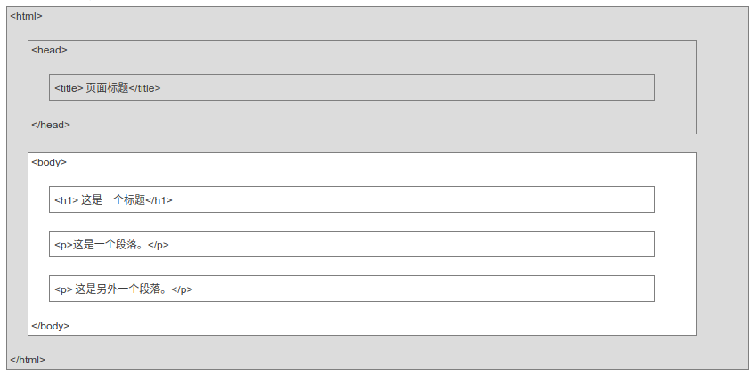
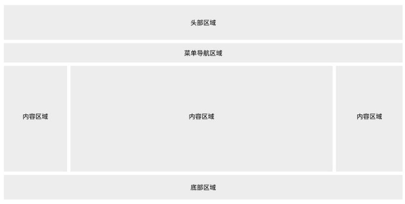
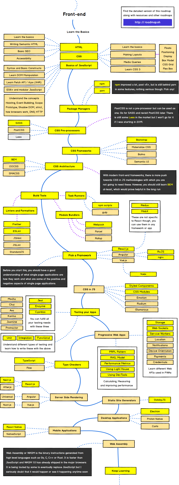

## HTML：HyperText Markup Language
- 声明：`<!DOCTYPE html>` 
- 布局  
    - 根元素：`<html>` 
        - 头部：`<head>`
            - 元数据：`<meta charset="UTF-8">`
            - 样式文件：``
            - 链接：`<link rel="" type="" href="">`
            - 文档标题：`<title>标题</title>`
        - `</head>`
        - 页面内容：`<body>`
            - 导航栏：`<nav>`
            - 大标题：`<h1></h1>`
            - 空元素：` `
            - 水平线：`
`
            - 注释：`<! -- 注释 -->`
            - 文本格式：`<b></b>` `<pre></pre>`
            - 文章：`<article></article>`
                - 侧边栏：`<aside></aside>`
            - 区段：`<section></section>`
            - 数学：`<math></math>`
            - 按钮：`<button>`
            - 链接：``
            - 图像：``
            - 画布(JavaScript)：`<canvas></canvas>`
            - 矢量图形(XML)：`<svg xmlns=""></svg>`
            - 视频：`<video><source></video>`
            - 音频：`<audio><source></audio>`
            - 插件： `<object></object>`
            - 段落：`

`
            - 表格：`<table border="1"><tr>(<th>)<td>`
            - 列表：`<ul>(<ol>)<li>`
            - 区块vs内联：`
` vs ``
            - 表单：`<form><input type="password", name="pwd">`
                - 选项列表：`<datalist><option></datalist>`
            - 框架：`<iframe src="url">`
            - 字符实体：`&lt` 
            - 页脚：`<footer></footer>`
            - 脚本：`` `<noscript></noscript>`
        - `</body>`
    - `</html>`

- 常用属性
    - 全局属性
        - 唯一id：`id`
        - 类名：`class`
        - 类型：`type`
        - 样式：`style`
        - 额外信息：`title`
        - 拖拽：`draggable`
        - 编辑内容：`contenteditable`
        - 表单：`placeholder required autocomplete list`
    - 事件属性
        - 窗口事件：`onload`
        - 表单事件：`onsubmit`
        - 键盘事件：`onkeypress`
        - 鼠标事件：`onclick ondrop` 
        - 多媒体事件：`onplay`
        - 其他事件：`onshow`

- 其他
    - 结束标签
    - 空元素：` `
    - 小写
    - 将正斜杠添加到地址末尾，否则会产生两次HTTP请求
    - URL编码：`%A9`
    - XHTML：XML + HTML 格式良好的HTML
    - 地理位置：`getCurrentPosition()`
    - Web存储：键值对
        - localStorage: 本地储存
        - sessionStorage：会话储存
    - Web SQL数据：使用SQL操作客户端数据库
        - openDatabase
        - transaction
        - executeSql
    - 应用程序缓存：`<html manifest="">`
    - Web worker：运行在后台的JavaScript
    - 服务器发送事件SSE:来自服务器的更新
    - WebSocket:TCP双全工通讯
    - Web应用 

## CSS: Cascading Style Sheets
- 语法： 选择器 + 声明(属性：值) `h1 {color:blue; font-size:12px;}`
- 注释：`/* */`
- 选择器：
    - id：`#id`
    - 类：`.class`
    - 分组：`h1,h2,p`
    - 嵌套： `div p`  `div>p` `div+p` `div~p`
    - 属性：`[attr=value]`
- 创建：按优先级
    - 内联样式：`@style`
    - 内部样式表：``
    - 外部引用：`<link rel="stylesheet" type="text/css" href="mystyle.css">`
- 属性
    - 背景：`background`
    - 文本：`color` `text-align` `text-decoration` `text-transform`
    - 字体：`font` `font-family` `font-size:px(16em, 100%)`
    - 列表样式：`list-style-type`
    - 圆角：`border-radius`
    - 盒子模型 
        - `width`
        - `margin`
        - `border`
        - `padding`
    - 轮廓：`outline-color`
    - 尺寸：`width height`
    - 显示：`display:block` `visibility`
    - 定位：`position`
    - 溢出添加滚动条：`overflow`
    - 图片浮动：`float：right`
    - 对齐：`margin:auto` `line-height`
    - 图像透明：`opacity`
    - 计数器：`counter-reset`
    - 渐变：`background: linear-gradient(direction(angle), color-stop1, color-stop2, ...);`
    - 多列：`column-count`
    - 框大小：`box-size`
    - 弹性盒子：`flex`
    - 用户界面：`resize` `outline-offset`
- CSS变量
    - 定义：`：root {--name:value}`
    - 使用：`attr:var(--name)`
- 功能实现
    - 下拉菜单：`.dropdown`
    - 提示工具：`.tooltip`
    - 图片廓：`.desc`
    - 图像拼接
    - 渲染表单
    - 按钮
    - **导航栏**
    - 分页
    - 页面布局 
- 颜色值：`rgb(255, 255, 0)`
    - 颜色名：`AliceBlue`
    - 十六进制：`#RRGGBB`
- 媒体类型：不同媒体呈现`@median screen`
- 伪类：`selector:pseudo-class {property:value;}`
    - anchor伪类：`a:link {color:#FF0000;} `
    - first-child伪类：`p:first-child {color:blue;}`
    - lang伪类：`q:lang(no) {quotes: "~" "~";}`
- 伪元素：`selector:pseudo-element {property:value;}`
    - `first-line`
    - `before`
- 规则：自定义
    - 字体：`@font-face`
    - 动画：`@keyframes`
- 2D/3D转换
    - 2D：`transform : rotate()`
    - 3D: `transform : rotateX()`
    - 过渡属性：`transition`
- 响应式Web设计
    - Viewport:`<meta name="viewport" content="width=device-width, initial-scale=1.0">`
    - 网格视图：`.col-6`
    - 多媒体查询：`@media only screen and (min-width: 480px)`
    - 图片和视频：`max-width: 100%` `height: auto`
- 框架：Bootstrap
- CSS Trick

