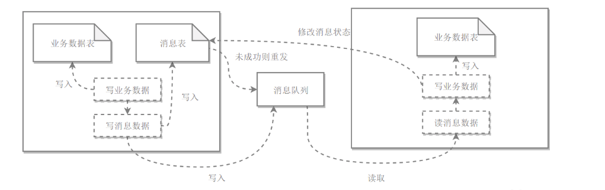

- I/O模型
    - 输入操作
        - 等待数据准备好: 数据从网络中到达时,它被复制到内核中的某个缓冲区
        - 从内核向进程复制数据: 内核缓冲区到应用进程缓冲区
    - 同步I/O:数据从内核缓冲区复制到应用进程缓冲区(第二阶段),应用进程会阻塞
        - 第一阶段阻塞
            - 阻塞式I/O:应用进程被阻塞,直到数据从内核缓冲区复制到应用进程缓冲区中才返回
            - I/O复用:使用select或poll等待数据(文件描述符),并且可以等待多个socket中的任何一个变为可读
                - `select`:实时性要求高的场景且可移植性高
                - `poll`:没有最大描述符数量的限制,适用于平台支持并对实时性要求不高
                - `epoll`:只运行在Linux上,有大量的描述符需要同时轮询,并且这些连接最好是长连接
                    - 在内核中用红黑树维护已有描述符
        - 第一阶段不阻塞 
            - 非阻塞式I/O:应用进程执行系统调用后,内核返回一个错误码
                - 轮询(polling):应用进程可以继续执行,但需要不断的执行系统调用来获知I/O是否完成
            - 信号驱动I/O:应用进程使用sigaction系统调用,内核立即返回,应用程序可以继续执行
    - 异步I/O:应用进程执行`aio_ready`系统调用会立即返回,应用进程可以继续执行,内核在所有操作完成之后向应用进程发送信号
- 设计模式:解决问题的方案
    - 创建型
    - 行为型
- 面向对象
    - 设计原则
        - S.O.L.I.D
- 系统设计
    - 性能
        - 指标
            - 响应时间:重复请求,计算平均响应时间
            - 吞吐量:单位时间内可以处理的请求数量
            - 并发用户数:同时处理的并发用户请求数量,多线程+I/O多路复用
        - 性能优化
            - 集群:使用负载均衡将请求转发到集群中
            - 缓存
            - 异步
    - 伸缩性:不断向集群中添加服务器来缓解不断上升的用户并发访问压力和不断增长的数据存储需求
        - 应用服务器:若不具有状态，可以通过负载均衡器向集群中添加新的服务器
        - 关系性数据库:通过`Sharding`来实现，将数据按一定的规则分布到不同的节点上
        - 非关系性数据库:为海量数据而生
    - 扩展性:添加新功能时对现有系统的其它应用无影响，要求不同应用具备低耦合的特点
        - 使用消息队列进行解耦，应用之间通过消息传递进行通信
        - 使用分布式服务将业务和可复用的服务分离开来，业务使用分布式服务框架调用可复用的服务
    - 可用性
        - 冗余:当某个服务器故障时就请求其他服务器
            - 应用服务器:若不具有状态,请求转发到另一台应用服务器
            - 存储服务器:主从复制,切换主服务器
        - 监控: CPU、内存、磁盘、网络等系统负载信息进行监控
        - 服务降级:系统为了应对大量的请求，主动关闭部分功能，从而保证核心功能可用
    - 安全性:系统在应对各种攻击手段时能够有可靠的应对措施
- 分布式
    - 分布式锁:实现进程同步
        - 数据库唯一索引
        - Redis命令
            - `SETNX`
            - `RedLock`
        - Zookeeper的有序节点
    - 分布式事务:事务的操作位于不同的节点上，需要保证事务的 ACID 特性
        - 两阶段提交(2PC)
        - 本地消息表 
    - CAP:分布式系统不可能同时满足一致性,可用性和分区容忍性
    - BASE:基本可用,软状态,最终一致性
    - Paxos:用于达成共识性问题，即对多个节点产生的值，该算法能保证只选出唯一一个值
    - Raft:分布式一致性协议，主要是用来竞选主节点
- 集群
    - 负载均衡:根据集群中每个节点(无状态)的负载情况，将用户请求转发到合适的节点上
        - 负载均衡算法
            - 轮询(Round Robin):每个请求轮流发送到每个服务器上
            - 加权轮询:根据服务器的性能差异，为服务器赋予一定的权值，性能高的服务器分配更高的权值
            - 最少连接:将请求发送给当前最少连接数的服务器上
            - 加权最少连接
            - 随机算法:请求随机发送到服务器上
            - 源地址哈希法(IP hash):对客户端IP计算哈希值之后，再对服务器数量取模得到目标服务器的序号
        - 转发实现
            - HTTP重定向
                - 缺点
                    - 需要两次请求，因此访问延迟比较高
                    - HTTP负载均衡器处理能力有限，会限制集群的规模
            - DNS域名解析:在DNS解析域名的同时使用负载均衡算法计算服务器IP地址
                - 优点:DNS能够根据地理位置进行域名解析，返回离用户最近的服务器IP地址
                - 缺点:由于DNS具有多级结构，每一级的域名记录都可能被缓存，当下线一台服务器需要修改DNS记录时，需要过很长一段时间才能生效
            - 反向代理服务器:反向代理可以用来进行缓存、日志记录等，同时也可以用来做为负载均衡服务器
                - 优点:与其它功能集成在一起，部署简单
                - 缺点:所有请求和响应都需要经过反向代理服务器，它可能会成为性能瓶颈
            - 网络层:根据负载均衡算法计算源服务器的IP地址，并修改请求数据包的目的IP地址，进行转发
                - 优点:在内核进程中进行处理，性能比较高
                - 缺点:所有的请求和响应都经过负载均衡服务器，会成为性能瓶颈
            - 链路层:根据负载均衡算法计算源服务器的MAC地址，并修改请求数据包的目的MAC地址,进行转发
                - 优点:源服务器的响应不需要转发回负载均衡服务器，可以直接转发给客户端(源服务器虚拟IP和负载均衡服务器的IP一致)
    - 集群下的Session管理:避免用户重复登录
        - Sticky Session:配置负载均衡器，用户的请求都路由到同一个服务器，把用户Session存放在该服务器中
            - 缺点:当服务器宕机时，将丢失该服务器上的所有 Session
        - Session Replication:在服务器之间进行Session同步操作，每个服务器都有所有用户的Session信息
            - 缺点
                - 占用过多内存
                - 同步过程占用网络带宽以及服务器处理器时间
        - Session Server:使用一个单独的服务器存储Session数据
            - 优点:将用户的会话信息单独进行存储，从而保证了应用服务器的无状态
            - 缺点:需要去实现存取Session的代码
- 攻击技术
    - 跨站脚本攻击
    - 跨站请求伪造
    - SQL注入攻击
    - 拒绝服务攻击
- 缓存
    - 缓存特征
        - 命中率:某个请求能够通过访问缓存而得到响应
        - 最大空间
        - 淘汰策略
            - FIFO:最先进入的数据（最晚的数据）被淘汰
            - LRU(Least Recently Used):优先淘汰上次被访问时间距离现在最久的数据
                - 双向链表:访问某个节点时，将其从原来的位置删除，并重新插入到链表头部,删除尾节点常量时间
                - HashMap:HashMap存储着Key到节点的映射，通过Key就能以常量时间得到节点
            - LFU(Least Frequently Used):优先淘汰一段时间内使用次数最少的数据
    - 缓存位置
        - 浏览器:当HTTP响应允许进行缓存时，浏览器会将 HTML、CSS、JavaScript、图片等静态资源进行缓存
        - ISP:网络访问的第一跳，通过将数据缓存在ISP中能够大大提高用户的访问速度
        - 反向代理:用户请求反向代理时就可以直接使用缓存进行响应
        - 本地缓存:数据缓存在服务器本地内存中，服务器代码可以直接读取本地内存中的缓存
            - `Guava Cache`
        - 分布式缓存:服务器集群都可以访问分布式缓存
            - `Redis`
            - `Memcache`
        - 数据库缓存:数据库管理系统具有自己的查询缓存机制来提高查询效率
            - `MySQL`
        - Java内部缓存
        - CPU多级缓存:使用MESI等缓存一致性协议来解决多核CPU缓存数据一致性的问题
    - CDN: 采用更靠近用户的服务器, 从而更快更可靠地将HTML、CSS、JavaScript、音乐、图片、视频等静态资源分发给用户
    - 缓存问题
        - 缓存穿透:对某个一定不存在的数据进行请求，该请求将会穿透缓存到达数据库
        - 缓存雪崩:由于数据没有被加载到缓存中，或者缓存数据在同一时间大面积失效（过期），又或者缓存服务器宕机，导致大量的请求都到达数据库
        - 缓存一致性:数据更新的同时缓存数据也能够实时更新
        - 缓存无底洞现象:为了满足业务要求添加了大量缓存节点，但是性能不但没有好转反而下降了的现象
    - 数据分布
        - 哈希分布:当节点数量变化时，那么几乎所有的数据都需要重新分布，将导致大量的数据迁移
            - 一致性哈希:克服传统哈希分布在服务器节点数量变化时大量数据迁移的问题
                - 基本原理:每个服务器节点都配置到哈希环上. 每个数据对象通过哈希取模得到哈希值之后，存放到哈希环中顺时针方向第一个大于等于该哈希值的节点上
                - 虚拟节点:虚拟节点在哈希环上分布的均匀性就会比原来的真实节点好，从而使得数据分布也更加均匀
        - 顺序分布:将数据划分为多个连续的部分，按数据的 ID 或者时间分布到不同节点上
            - 优点
                - 能保持数据原有的顺序
                - 并且能够准确控制每台服务器存储的数据量，从而使得存储空间的利用率最大
- 消息队列
    - 消息模型
        - 点对点:消息生产者向消息队列中发送了一个消息之后，只能被一个消费者消费一次
        - 发布/订阅:消息生产者向频道发送一个消息之后，多个消费者可以从该频道订阅到这条消息并消费
    - 使用场景
        - 异步处理:发送者将消息发送给消息队列之后，不需要同步等待消息接收者处理完毕，而是立即返回进行其它操作
        - 流量削锋:请求发送到消息队列中，服务器按照其处理能力从消息队列中订阅消息进行处理
        - 应用解耦:一个模块只需要向消息队列中发送消息，其它模块可以选择性地从消息队列中订阅消息从而完成调用
    - 可靠性
        - 发送端的可靠性:发送端完成操作后一定能将消息成功发送到消息队列中
            - 在本地数据库建一张消息表，将消息数据与业务数据保存在同一数据库实例里,利用事务机制
        - 接收端的可靠性:从消息队列成功消费一次消息
            - 保证接收端处理消息的业务逻辑具有幂等性
            - 保证消息具有唯一编号，并使用一张日志表来记录已经消费的消息编号