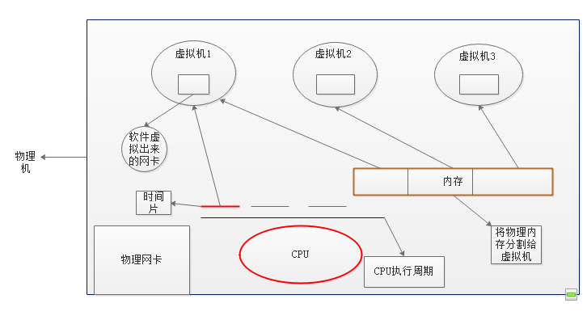
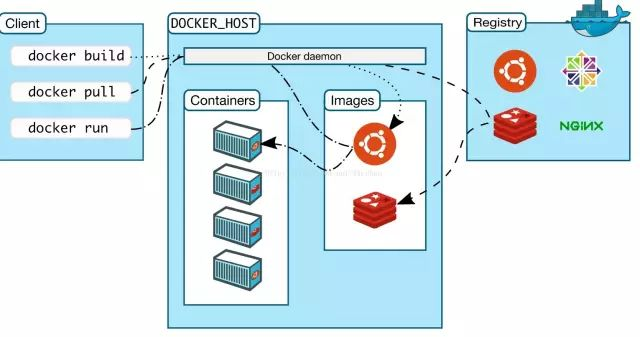

- 虚拟技术
    - 虚拟计算机 
        - KVM 
        - Virtualbox 
        - 
        - Vmwares
    - 虚拟操作系统
        - docker 
            - client：`docker`
            - docker_host: container+images
            - registry: images
        ```docker
        ## List Docker CLI commands
        docker
        docker container --help

        ## Display Docker version and info
        docker --version
        docker version
        docker info

        ## Execute Docker image
        docker run hello-world

        ## List Docker images
        docker image ls

        ## List Docker containers (running, all, all in quiet mode)
        docker container ls
        docker container ls --all
        docker container ls -aq

        ``` 