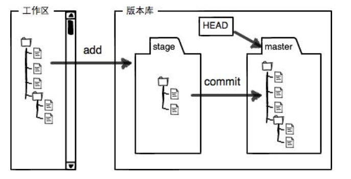
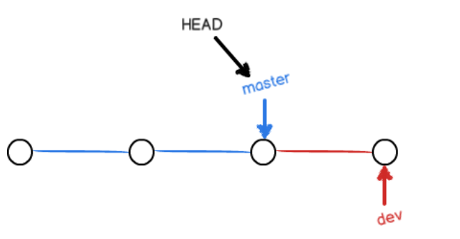

## 简介
- 版本控制系统
    - 集中式
        - SVN
    - 分布式
        - git: 文件名不区分大小写
## Git
- 配置：`git config --global user.name(user.email) <name>(<email>)` 
- 版本库：只能跟踪文本文件的改动
    - 创建：`git init`
    - 查看：`git status`
    - 添加：`git add <filename>`
    - 提交：`git commit -m <message>`
- 版本回退：时间线
    - 查看修改内容：`git diff <filename>`
    - 查看历史记录：`git log --pretty=oneline`
    - 回退版本：`git reset --hard HEAD^(commit_id)`
    - 重返未来：`git reflog`(记录每一次命令)
- 工作区和暂存区：
- 管理修改：git跟踪管理的是修改，而非文件
    - 工作区和版本库最新版本的区别：`git diff HEAD -- <filename>`
- 撤销修改
    - 工作区：`git checkout -- <filename>`
    - 暂存区：`git reset HEAD <filename>`
- 删除文件：`git rm <filename>`
- 查看版本库文件：`git ls-files`
- 远程仓库
    - 连接
        - 本地创建SSH Key：`ssh-keygen -t rsa -C <email>`
        - 在GitHub上添加SSH Key：`id_rsa.pub`
    - 添加远程库：`git remote add origin git@server-name:path/repo-name.git`
        - 权限：`git remote -v`
    - 推送
        - 第一次：`git push -u origin master`
        - 以后：`git push origin master`
    - 克隆：`git clone git@server-name:path/repo-name.git`
- 分支管理：
    - 创建和合并分支：
        - 创建dev分支：`git checkout -b dev` = `git branch dev` + `git checkout dev`
        - 列出分支：`git branch`
        - 合并分支
            - Fast-forword(丢失分支信息)：`git checkout master`+`git merge dev`
            - no-ff(新的提交)：`git merge --no-ff -m <message> dev`
        - 删除分支：`git branch -d dev`
    - 解决冲突：手动编辑为需要的内容再提交 
        - 分支合并图：`git log --graph`
    - 分支合并策略 
    - Bug分支：确定哪个分支修复Bug，就从那个分支创建临时分支
        - 储藏当前分支：`git stash`
        - 修复Bug
        - 恢复：`git stash pop(apply)`
    - Feature分支
        - 新建
        - 强行删除：`git branch -D <name>`
    - 多人协作
        - 本地创建和远程对应的分支：`git checkout -b dev origin/dev`
        - 推送
            - 直接推送：`git push origin dev`
            - 失败
                - 建立本地和远程分支关联：`git branch --set-upstream-to=origin/dev dev`
                - 再拉取：`git pull`
                - 解决冲突，再推送
    - 强迫症选项
        - 把本地未push的分叉提交历史整理成直线：`git rebase`
    - 标签管理
        - 创建标签
            - 默认HEAD：`git tag <name>`
            - 指定：`git tag -a <name> -m <message> commit_id`
        - 查看标签：`git tag`
        - 标签信息：`git show <tagname>`
        - 操作标签
            - 推送本地标签：`git push origin <tagname>`
            - 推送全部未推送过的本地标签：`git push origin --tags`
            - 删除一个本地标签：`git tag -d <tagname>git tag -d <tagname>`
            - 删除远程标签：`git push origin :refs/tags/<tagname>`
- GitHub和Gitee
    - `git remote add gitee git@gitee.com:liaoxuefeng/learngit.git`
    - `git remote add github git@github.com:michaelliao/learngit.git`
- 自定义：`git config --global color.ui true`
    - 忽略特殊文件：`.gitignore`
        - 检查：`git check-ignore -v <filename>`
    - 配置别名：`git config --global alias.unstage 'reset HEAD'`
    - 搭建Git服务器(Ubuntu)
        - 安装git：`sudo apt-get install git`
        - 创建git用户：`sudo adduser git`
        - 创建证书登录
            - 公钥导入`/home/git/.ssh/authorized_keys`
            - 管理公钥：Gitosis
        - 初始化仓库：`/srv/sample.git`
              - 初始：`sudo git init --bare sample.git`
              - 拥有者：`sudo chown -R git:git sample.git`
              - 管理权限：Gitolite
        - 禁止shell登陆：`git:x:1001:1001:,,,:/home/git:/usr/bin/git-shell`
        - 克隆远程窗口：`git clone git@server:/srv/sample.git`

